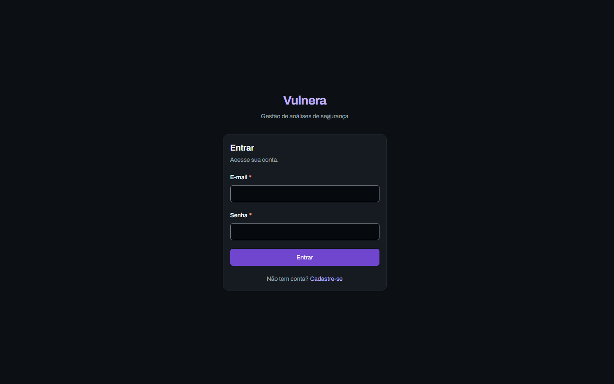
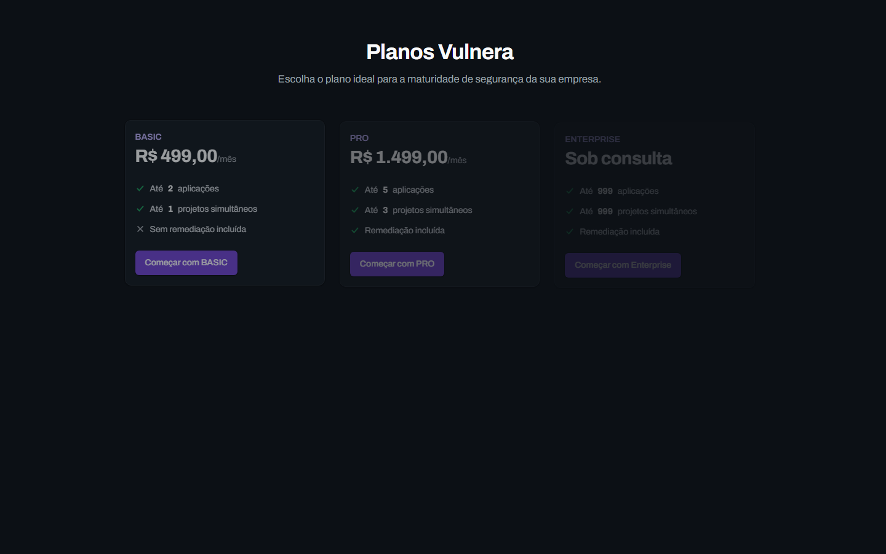
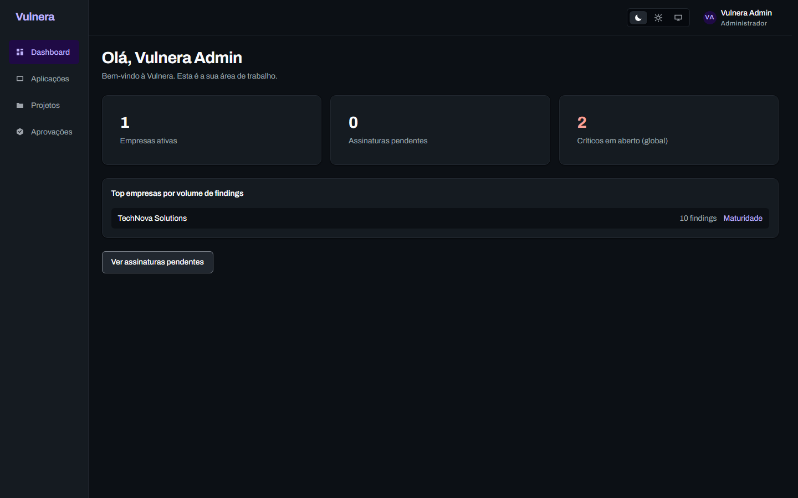
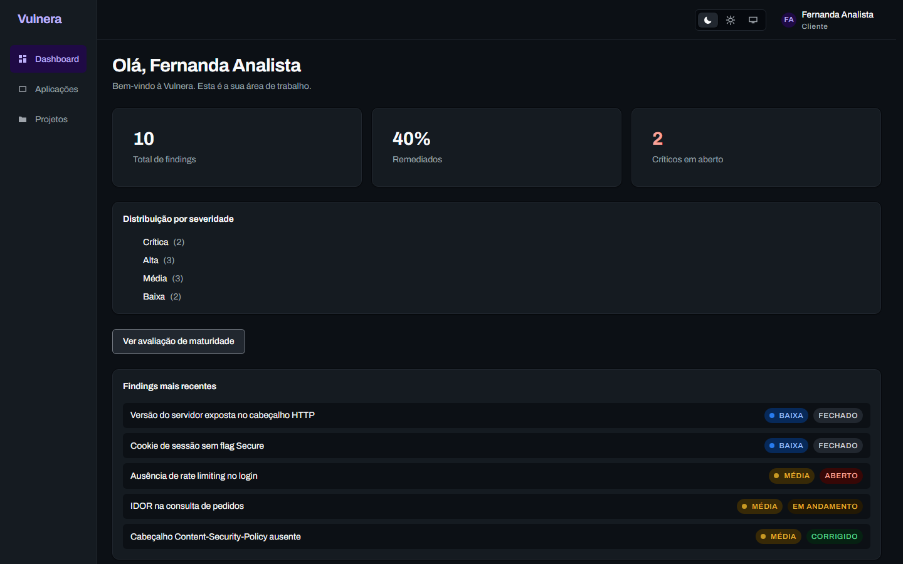
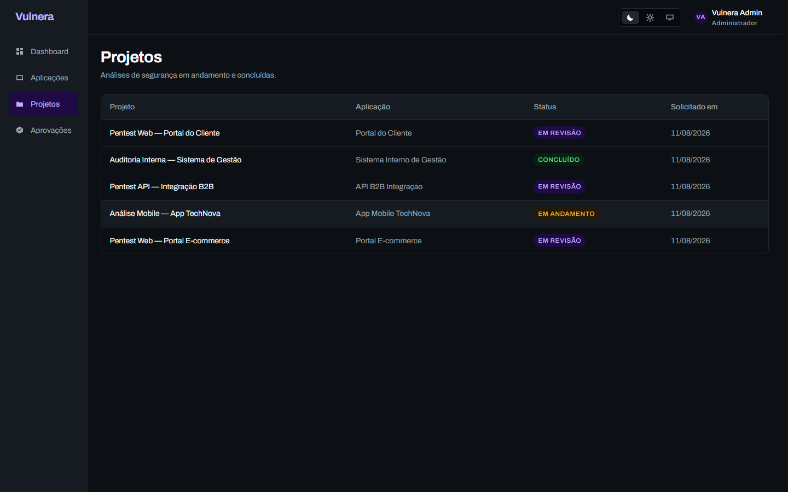
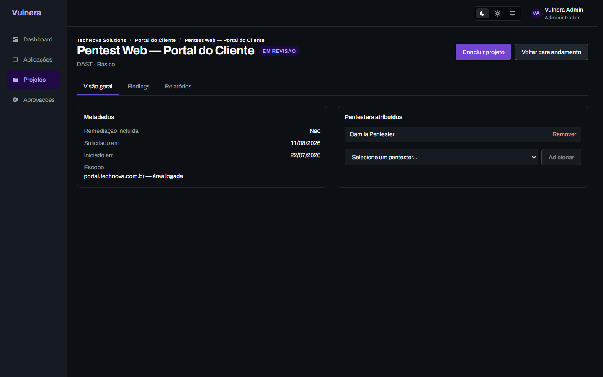
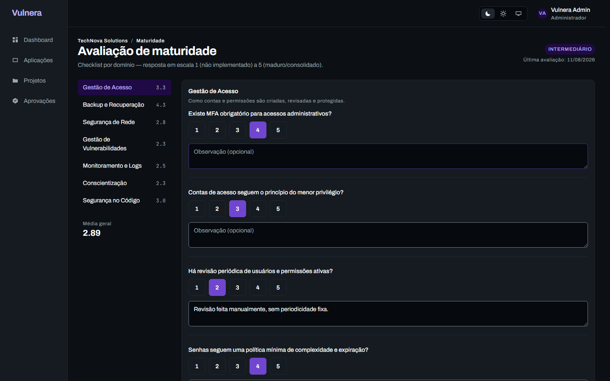
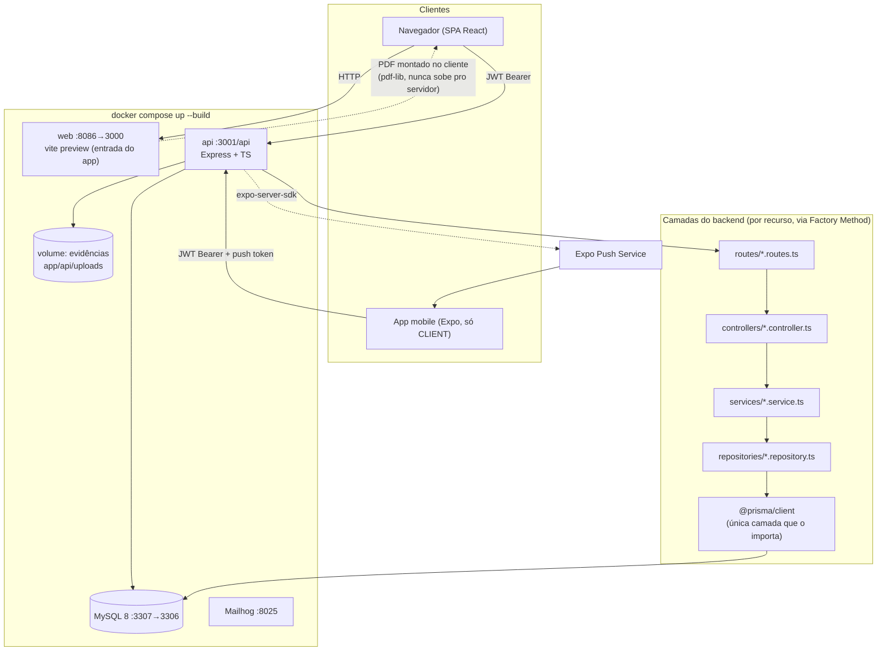

# Vulnera

**Plataforma SaaS multi-tenant de gestão de vulnerabilidades** — TCC de
Rafael Guilherme. Empresas contratam análises de segurança (pentest,
auditoria), pentesters registram findings com severidade calculada
automaticamente por CVSS 3.1, clientes acompanham a remediação em tempo
real e exportam relatórios executivos/técnicos em PDF — tudo isolado por
empresa (multi-tenancy) e por papel (ADMIN / CLIENT / PENTESTER).

> Vulnera **gerencia** o processo de segurança — não executa scans
> automatizados nem substitui um pentester humano (ADR-001).

---

## Sumário

- [O problema e a solução](#o-problema-e-a-solução)
- [Screenshots](#screenshots)
- [Stack](#stack)
- [Arquitetura](#arquitetura)
- [Setup do zero](#setup-do-zero)
- [Demo guiada](#demo-guiada)
- [Qualidade e segurança](#qualidade-e-segurança)
- [Estrutura do repositório](#estrutura-do-repositório)
- [Limitações conhecidas](#limitações-conhecidas)
- [Trabalho futuro](#trabalho-futuro)

---

## O problema e a solução

Empresas que contratam pentest/auditoria de segurança hoje recebem os
resultados por **e-mail, PDF solto ou planilha** — sem histórico
centralizado, sem trilha de auditoria, sem visibilidade de quantos riscos
críticos seguem em aberto. A Vulnera resolve isso com:

- **Catálogo de aplicações e projetos de análise** por empresa, com plano
  comercial limitando quantas aplicações cada uma pode ter.
- **Findings com severidade calculada**, não digitada — o vetor CVSS 3.1
  é a fonte da verdade, com override manual só mediante justificativa
  auditada (RN21).
- **Evidências validadas pelo conteúdo real do arquivo** (magic number),
  não pela extensão declarada.
- **Relatórios PDF gerados no navegador** (Executivo e Técnico), sem o
  arquivo nunca passar pelo servidor (ADR-003).
- **Checklist de maturidade de segurança** por domínio — visão rápida de
  quão preparado está o ambiente do cliente, sem pretender ser uma
  auditoria SAMM completa.
- **Scans DAST automatizados via OWASP ZAP** — o pentester informa uma URL e
  a plataforma sobe um container ZAP, roda spider + active scan e devolve
  findings estruturados, o relatório HTML original e um PDF, sem mais
  nenhuma intervenção manual (ver `docs/DAST.md`).
- **App mobile read-only** pro cliente acompanhar findings e receber push
  quando algo crítico é registrado.
- **Isolamento multi-tenant real**, provado por dezenas de testes de
  canário (`TEN-*`) em toda fase que toca dado de cliente.

---

## Screenshots

| Login | Planos (público) |
| --- | --- |
|  |  |

| Dashboard ADMIN | Dashboard CLIENT |
| --- | --- |
|  |  |

| Projetos | Detalhe de projeto |
| --- | --- |
|  |  |

| Avaliação de maturidade |
| --- |
|  |

*(Screenshots capturados via Playwright contra a stack real em
`docker compose up --build`, com os dados de demonstração da TechNova
Solutions — ver `docs/DEMO.md`.)*

---

## Stack

| Camada | Tecnologia |
| --- | --- |
| Backend | Node.js + Express 5 + TypeScript, arquitetura em camadas (`routes → controllers → services → repositories`), Factory Method obrigatório na montagem de cada recurso |
| Banco | MySQL 8 via Prisma ORM |
| Frontend web | React 18 + Vite + TypeScript, TanStack Query, Zustand, Tailwind, design system próprio (sem Radix, ADR-023) |
| PDF | pdf-lib, montado **no cliente** (ADR-003) — gráficos de barra e radar desenhados à mão por coordenada |
| Mobile | Expo (React Native) — app read-only exclusivo do papel CLIENT (ADR-004), push via Expo Notifications |
| Autenticação | JWT (access 15 min + refresh 7 dias rotativo), bcrypt cost 12 |
| Infra local | Docker Compose (MySQL + Mailhog + API + Web) |
| CI | GitHub Actions (lint, build, test, SonarQube) |
| Testes | Jest + Supertest (backend, 269 testes de integração) · Vitest + Testing Library + axe-core (frontend, 24 testes de acessibilidade/tema/filtros) |

---

## Arquitetura



---

## Setup do zero

### Pré-requisitos

- Docker + Docker Compose
- Node.js 20+ (só necessário pro modo de desenvolvimento com hot reload)

### Modo rápido — stack completa num comando (recomendado pra avaliar o projeto)

```bash
git clone https://github.com/guimunizzz/Vulnera-TCC.git
cd Vulnera-TCC
docker compose up --build          # sobe MySQL + Mailhog + API + Web
docker compose exec api npm run db:seed   # popula a empresa de demo (TechNova)
```

Acesse:

- **Web** (entrada do app): http://localhost:8086
- **API**: http://localhost:3001/api
- **Mailhog** (e-mails capturados): http://localhost:8025

Credenciais de demo em `docs/DEMO.md`.

### Modo desenvolvimento — hot reload (ADR-022)

```bash
docker compose up -d db mailhog    # só a infra

cd app/api
cp .env.example .env               # ajustar se necessário
npm install
npx prisma migrate dev
npm run db:seed
npm run dev                        # http://localhost:3001

cd ../web
npm install
npm run dev                        # http://localhost:3000

cd ../mobile
npm install
npx expo start                     # QR code pro Expo Go (edite .env com o IP da rede local)
```

`npm run check` (lint + testes) em `app/api` e `app/web` antes de qualquer PR.

---

## Demo guiada

Roteiro cronometrado (~10 min) cobrindo os 3 perfis, do onboarding até o
push no celular: **[`docs/DEMO.md`](docs/DEMO.md)**.

---

## Qualidade e segurança

- **269 testes de integração** no backend (Jest + Supertest) — happy path,
  validação, regra de negócio e isolamento multi-tenant (`TEN-*`) em cada
  recurso que toca dado de cliente.
- **24 testes de frontend** (Vitest + Testing Library + axe-core) —
  acessibilidade, contraste (WCAG AA, 66 pares medidos, 0 falhas), tema,
  filtros.
- **OWASP ZAP baseline** contra a stack de produção real (não o dev
  server) — evidência completa em [`docs/evidencias/zap/`](docs/evidencias/zap/README.md).
  0 FAIL, achados corrigidos onde era barato (headers de segurança, um bug
  real que impedia o próprio `docker compose up --build` de buildar), resto
  documentado como limitação conhecida.
- **SonarQube** integrado ao CI (análise estática + cobertura) — evidência
  em [`docs/evidencias/sonarqube/`](docs/evidencias/sonarqube/), modo
  informativo (não bloqueia merge — ADR-007, decisão consciente pra não
  travar um projeto de TCC com Quality Gate mal calibrado).
- **CVSS 3.1 validado** contra 13 vetores oficiais do FIRST/NVD + varredura
  exaustiva dos 2592 vetores base possíveis, sem NaN/Infinity, com paridade
  0-divergências entre o cálculo do frontend e do backend.
- **Upload de evidência validado por magic number**, não por extensão —
  27 testes de superfície de ataque (path traversal, IDOR, polyglot,
  Content-Type forjado).

---

## Estrutura do repositório

```
app/
├── api/        # backend — Node/Express/Prisma/MySQL
├── web/        # frontend — React/Vite
└── mobile/     # app mobile — Expo (só CLIENT)
docs/
├── DEMO.md                    # roteiro de demonstração
├── BACKLOG.md                 # backlog por fase
├── ROADMAP_PROMPTS.md         # prompts de execução por fase
├── evidencias/                # ZAP, SonarQube, screenshots
└── Vulnera/                   # vault de documentação (ADRs, contexto, decisões)
PRD_VIVO.md                    # estado de implementação, atualizado a cada fase
CLAUDE.md                      # guia de como o código é escrito neste projeto
```

Documentação viva: `PRD_VIVO.md` é a fonte da verdade de "o que já foi
feito"; `docs/Vulnera/07-Decisoes/` tem os ADRs de toda decisão não-trivial.

---

## Limitações conhecidas

Registradas de propósito — closure de TCC prioriza documentar débito
técnico consciente em vez de escondê-lo.

| Limitação | Por que existe / por que não foi corrigida agora |
| --- | --- |
| **`react-router-dom@6.28.0`** tem um Open Redirect conhecido (fix só na major 7.x) | Upgrade de major version muda API de rotas — exigiria re-testar toda a navegação. Fora do orçamento de uma sessão de fechamento. |
| **Dockerfiles não usam `npm ci`/lockfile** (`app/api`, `app/web`) | Builds não são 100% reprodutíveis (resolvem semver ranges a cada build, não a árvore exata do lockfile). Corrigir exigiria mudar o build context pra raiz do monorepo (workspace tem um lockfile único fora do context atual) — mudança estrutural, não um fix pontual. |
| **Sem CSP (Content-Security-Policy)** no frontend | O design system usa `style` inline em vários componentes; uma CSP estrita o bastante pra valer a pena exigiria testar a aplicação inteira contra ela. Ver `docs/evidencias/zap/README.md`. |
| **Sem rate limiting** (login, upload) | Fora do escopo do MVP — exigiria decisão de store (Redis está cortado do escopo). |
| **Sem `DELETE` de Evidence** | Evidência anexada por engano não pode ser removida pela API hoje. |
| **Chunk único de ~1.4MB no build do frontend** | Sem code-splitting por rota — aceitável pro tamanho atual do produto, mas cresce sem controle se novas telas grandes entrarem. |
| **Push notification** testado só via mock/API — não em celular físico | Ambiente deixado pronto (`.env` do mobile com IP da rede local, `expo start` documentado); requer aparelho real, fora do alcance de um agente. |
| **Migração de telas pro design system** (Fase 6.5) parcialmente mecânica | Tokens e componentes aplicados em todas as telas, mas skeleton/vazio/erro têm polimento desigual entre elas. |

Lista completa e histórica em `docs/BACKLOG.md`.

---

## Trabalho futuro

Cortado do escopo do MVP deliberadamente (não é ausência por esquecimento):

- **IA / sugestão automática de finding** — cortado em 2026-08-03, não é o
  que a banca avalia num TCC de 7 meses.
- **Chat em tempo real** entre cliente e pentester (`VulnerabilityComment`
  cobre a comunicação assíncrona hoje).
- **Sistema de tickets de suporte.**
- **Observabilidade** (Prometheus/Grafana, tracing distribuído).
- **E-mail transacional real** (hoje só Mailhog local).
- **Pagamento real** (assinatura hoje é aprovada manualmente pelo admin).
- **i18n** — produto em PT-BR só.
- **Reset de senha via e-mail.**
- **Reproducibilidade completa de build Docker** (`npm ci` + lockfile do
  workspace, ver Limitações conhecidas).
- **Content-Security-Policy real**, calibrada e testada contra a UI
  inteira.

---

*Vulnera — TCC de Rafael Guilherme. Ver `CLAUDE.md` pra convenções de
código e `PRD_VIVO.md` pro estado de implementação fase a fase.*
