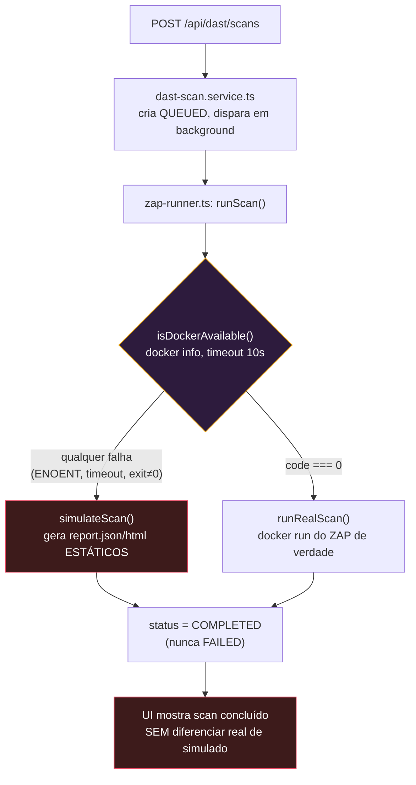

# DAST-DOCKER-GAP.md — Por que o scan real cai para simulado dentro da stack Docker

> Relatório de diagnóstico, não um ADR de decisão já tomada. Escrito em
> 2026-09-06, depois de subir a stack completa (`docker compose up --build`,
> porta de entrada `8086`) e constatar que um scan disparado pela UI "funciona"
> mas usa dados simulados em vez de rodar o ZAP de verdade.
>
> Todas as causas abaixo foram **confirmadas lendo o código e a configuração
> reais**, não deduzidas por suposição — cada seção cita o arquivo e a linha.

---

## 1. Resumo executivo

**O sintoma "Docker indisponível" não é um erro que aparece na tela.** O
módulo DAST foi desenhado para nunca travar: se `docker info` falhar, ele cai
**silenciosamente** para um gerador de relatório simulado
(`simulateScan()`), e o scan "completa" normalmente na interface — sem
nenhum aviso visual, nenhum log de servidor, nenhum campo salvo no banco.
A única pista é abrir o relatório gerado e ler, dentro dele,
`"ZAP (simulado — Docker indisponível)"`.

Isso quer dizer que **o produto está se comportando exatamente como foi
projetado** — só que o cenário em que ele está rodando agora
(`docker compose up --build`, API dentro de um container) nunca tinha sido
testado com scan real antes desta sessão. Todos os scans reais que existem
como evidência (`docs/evidencias/dast/`) foram feitos com a API rodando
**localmente** (`npm run dev`), fora de qualquer container.

Existem **três causas técnicas encadeadas** — corrigir só a primeira não
resolve o problema, ela só revela a segunda, que revela a terceira — mais
**uma lacuna de produto** (nenhuma sinalização de que o scan foi simulado).
Nenhuma foi corrigida neste relatório: é um diagnóstico, a decisão de qual
caminho seguir fica com o Rafael (ver §5).

---

## 2. O que realmente acontece (ordem de execução)



Trecho exato que decide isso (`app/api/src/services/zap-runner.service.ts`,
função `runScan`):

```ts
export async function runScan(options: RunScanOptions): Promise<ScanOutcome> {
  const forceSimulate = EnvVar.getOptional(EnvKeys.DAST_FORCE_SIMULATE, "false").toLowerCase() === "true";
  const dockerOk = !forceSimulate && (await isDockerAvailable());
  const timeoutMs = options.timeoutMs ?? getTimeoutMs();
  if (!dockerOk) {
    return simulateScan(options.scanId, options.targetUrl, timeoutMs);
  }
  return runRealScan(options.scanId, options.targetUrl, timeoutMs);
}
```

Isto é **intencional e documentado** (`docs/DAST.md` §4, cabeçalho do
próprio arquivo): o fallback existe para que o CI e ambientes sem Docker
continuem exercitando o pipeline de ponta a ponta. O problema não é a
existência do fallback — é que ele está sendo acionado num ambiente
(a stack Docker completa) onde a intenção era rodar de verdade.

---

## 3. As três causas raiz, em cadeia

### Causa 1 — o binário `docker` não existe dentro da imagem da API

`app/api/Dockerfile` usa `node:22-alpine` e instala apenas o necessário
para compilar o `bcrypt`:

```dockerfile
RUN apk add --no-cache python3 make g++
```

**Não há `apk add docker-cli`.** Quando `isDockerAvailable()` chama
`execFile("docker", ["info"], ...)` de dentro do container da API, o
sistema operacional do container não encontra o executável — o processo
falha com `ENOENT` antes mesmo de tentar falar com um daemon. Isso sozinho
já é suficiente para todo scan cair em `simulateScan()`.

**Como confirmar:** `docker compose exec api which docker` retorna vazio
(comando não encontrado).

### Causa 2 — mesmo com o CLI instalado, não há socket para ele conversar

`docker-compose.yml`, serviço `api`:

```yaml
volumes:
  - vulnera-api-uploads:/app/uploads
```

Só o volume de uploads. **Nenhum socket do Docker do host está montado.**
Para um container conseguir orquestrar containers *irmãos* no mesmo host
(o padrão chamado "Docker outside of Docker", DooD — é exatamente o que o
`ADR-028` já usa: um container por scan, nunca aninhado), ele precisa
enxergar o socket do daemon do host, normalmente montado como:

```yaml
volumes:
  - /var/run/docker.sock:/var/run/docker.sock
```

Sem isso, mesmo com o CLI instalado (Causa 1 corrigida), `docker info`
teria êxito em *executar*, mas falharia ao *conectar* — o resultado prático
para `isDockerAvailable()` é o mesmo: `code !== 0`, cai no simulado.

### Causa 3 — mesmo com as duas primeiras resolvidas, o caminho do volume não bate (a mais sutil)

Esta é a causa que **só aparece depois** de corrigir as duas primeiras, e é
o motivo de este relatório recomendar cautela antes de simplesmente "montar
o socket e seguir": mesmo funcionando, o resultado seria um scan que
completa, mas nunca encontra o `report.json`, e falha com uma mensagem
confusa.

`app/api/src/services/zap-runner.service.ts`, função `runRealScan`:

```ts
function getReportsDir(): string {
  return path.resolve(process.cwd(), EnvVar.getOptional(EnvKeys.DAST_REPORTS_DIR, "dast-reports"));
}
// ...
const reportsDir = getReportsDir();
const scanDir = path.resolve(reportsDir, scanId);
// ...
const hostDir = scanDir; // ⚠️ comentário no código já avisa: "caminho nativo do
                          // Windows... quando quem chama é o Node" — mas isso
                          // só é verdade quando o NODE roda no HOST, não dentro
                          // de um container.
const args = ["run", "--rm", "--name", containerName, "-v", `${hostDir}:/zap/wrk/:rw`, ZAP_IMAGE, ...];
```

Quando a API roda **dentro do container**, `process.cwd()` resolve para
algo como `/app` (o `WORKDIR` do `Dockerfile`), então `hostDir` vira
`/app/dast-reports/<scanId>` — um caminho que só existe **dentro do
container da API**.

O comando `docker run -v /app/dast-reports/<scanId>:/zap/wrk/:rw ...` não é
executado pelo container da API — ele é apenas **enviado via socket** para
o daemon do **host**, que interpreta esse caminho no **contexto do host**
(ou, no caso do Docker Desktop com backend WSL2, no contexto da VM Linux
que o Docker Desktop gerencia — que não é o filesystem do container `api`).
O resultado típico é o Docker criar silenciosamente um diretório vazio
nesse caminho (dentro da VM do Docker Desktop) e montá-lo no container do
ZAP — o ZAP escreve `report.json` ali, num lugar que a API **nunca vai
olhar**, porque a API está procurando o arquivo no seu próprio
`/app/dast-reports/<scanId>` (que é outro diretório, dentro do container da
API).

Resultado: o scan seria classificado como `FAILED` com a mensagem genérica
`"docker saiu com código 0 sem gerar report.json"` — nem `TIMEOUT` nem
`DOCKER_UNAVAILABLE`, um terceiro sintoma que confundiria ainda mais o
diagnóstico se as Causas 1 e 2 fossem corrigidas isoladamente.

---

## 4. Por que isso nunca foi pego antes

Não é regressão de nenhuma sessão anterior — é a **primeira vez** que este
par de features é exercitado junto. Evidência no próprio `docs/DAST.md`
(escrito na Fase 9, antes de a stack Docker completa existir com o formato
atual):

> "Caminho de volume no Windows quebra quando invocado via Git Bash/MSYS...
> **Isso NÃO afeta o runner de produção** — Node's `execFile` chama
> `docker.exe` diretamente, sem passar por nenhum shell MSYS."

Essa nota já demonstra a suposição implícita em todos os testes da Fase 9:
o processo Node do `zap-runner.service.ts` sempre rodou **no host**,
nunca dentro de um container. Os dois scans reais documentados em
`docs/evidencias/dast/` (contra `example.com` e o Juice Shop) foram feitos
nesse modo. A combinação "API em container + scan real" só passou a ser
possível depois que a sessão anterior encapsulou a stack inteira com
`docker compose up --build` e porta `8086` — e ninguém tinha rodado um
scan de verdade nesse modo específico ainda.

---

## 5. Lacuna de produto — o estado "simulado" é invisível

Independente da causa técnica, há um problema de UX que vale corrigir
mesmo antes (ou além) de resolver o DooD: **nada informa ao usuário que o
scan que ele acabou de rodar não é real.**

Confirmado por grep — zero ocorrências da palavra `simulated` fora do
próprio `zap-runner.service.ts`:

| Onde deveria aparecer e não aparece | Situação real |
|---|---|
| `dast-scan.service.ts` | Lê `outcome.simulated` do retorno de `runScan()`? **Não.** O campo é descartado — só `status`/`errorMessage`/paths são usados. |
| `schema.prisma` (`DastScan`) | Existe coluna `simulated`? **Não.** |
| Resposta da API (`GET /scans/:id`) | Devolve alguma flag indicando simulação? **Não.** |
| `dast-page.tsx` / `dast-scan-detail-page.tsx` | Algum aviso visual (badge, banner)? **Não** — grep confirma zero menção a "simulad" nos dois arquivos. |
| Log do servidor (`console.*`) | Algum aviso no boot ou por scan? **Não** — o único `console.error` existente no service é para exceção não tratada, que não é o caso do fallback (ele retorna normalmente). |

Ou seja: um scan simulado e um scan real são **indistinguíveis** em toda a
aplicação, exceto abrindo o `report.json`/`report.html` e lendo o texto
`"(simulado — Docker indisponível)"` escrito dentro do conteúdo do
relatório.

---

## 6. Caminhos de solução

### Opção A — Rodar a API fora do container só para usar o DAST (contorno imediato, zero mudança de código)

O próprio `ADR-022` já documenta e mantém este modo como suportado:

```bash
docker compose up -d db mailhog    # só a infra
cd app/api && npm run dev          # API local, acessa o Docker do host direto
```

Nesse modo, `execFile("docker", ...)` roda no host de verdade — é
exatamente o cenário em que os dois scans reais documentados em
`docs/evidencias/dast/` funcionaram. **Nenhuma das três causas acima se
aplica.** O custo é abrir mão de "tudo num container" enquanto for usar o
DAST — mas banco, Mailhog e (se quiser) o `web` continuam em container
normalmente.

**Recomendado como resposta imediata** enquanto a Opção B não for
implementada — é literalmente reverter para um modo já testado e já
documentado, sem escrever uma linha de código nova.

### Opção B — Resolver o DooD de verdade, mantendo tudo em container

Três mudanças, na ordem em que as causas foram descritas:

**1. Instalar o CLI do Docker na imagem da API** (`app/api/Dockerfile`):

```dockerfile
RUN apk add --no-cache python3 make g++ docker-cli
```

**2. Montar o socket do host** (`docker-compose.yml`, serviço `api`):

```yaml
volumes:
  - vulnera-api-uploads:/app/uploads
  - /var/run/docker.sock:/var/run/docker.sock
```

⚠️ **Problema de permissão que isso introduz**: o `Dockerfile` da API cria
um usuário não-root (`vulnera`) e roda o processo com `USER vulnera`. O
socket do Docker no host normalmente pertence ao grupo `docker` (ou root)
com permissão `srw-rw----`. Um usuário sem esse GID dentro do container
recebe `permission denied` ao tentar usar o socket, **mesmo montado
corretamente**. Duas saídas, nenhuma limpa:
  - rodar o container da API como root (reverte a boa prática de segurança
    que o próprio `Dockerfile` implementou);
  - ou descobrir o GID do grupo dono do socket no host e recriar o usuário
    `vulnera` com esse GID — frágil, porque o GID do Docker Desktop pode
    mudar entre instalações/hosts, então isso quebraria em qualquer máquina
    diferente da atual.

**3. Corrigir a tradução de caminho do bind mount** — a parte que exige
mudança de lógica, não só de configuração. É preciso que a API, mesmo
rodando em `/app` internamente, monte o argumento `-v` do `docker run` do
ZAP usando o caminho **do host**, não o caminho interno do container.
Isso exige:

  - Montar o diretório de relatórios como *bind mount* explícito (não
    calculado por `process.cwd()`), igual ao volume de uploads:
    ```yaml
    volumes:
      - vulnera-api-uploads:/app/uploads
      - ./app/api/dast-reports:/app/dast-reports
      - /var/run/docker.sock:/var/run/docker.sock
    ```
  - Uma variável de ambiente **nova**, algo como `DAST_REPORTS_HOST_DIR`,
    apontando para o caminho absoluto **do host** (`docker-compose.yml`
    conhece esse caminho — é o lado esquerdo do bind mount acima).
  - Ajustar `zap-runner.service.ts` para usar `DAST_REPORTS_HOST_DIR`
    (quando definida) ao montar o argumento `-v` do container do ZAP,
    mantendo `getReportsDir()` (caminho interno) para todas as operações
    de `fs.*` — os dois precisam apontar para o **mesmo diretório físico**,
    só que descrito de duas formas diferentes (uma para o processo Node
    local, outra para o daemon do host).

  Esboço da mudança (não aplicada — este documento é diagnóstico):

  ```ts
  // zap-runner.service.ts
  function getReportsHostDir(scanId: string): string {
    const hostBase = EnvVar.getOptional(EnvKeys.DAST_REPORTS_HOST_DIR, "");
    if (hostBase) return path.resolve(hostBase, scanId); // caminho que o DAEMON entende
    return path.resolve(getReportsDir(), scanId);          // fallback: API roda no host mesmo
  }
  // runRealScan usa getReportsHostDir(scanId) no argumento -v,
  // e continua usando getReportsDir() (interno) pros fs.mkdir/fs.readFile/fs.access.
  ```

**Risco de segurança adicional que a Opção B introduz** (não existia
quando a API rodava localmente): o socket do Docker passa a estar
acessível **de dentro de um container que também serve tráfego HTTP de
rede**. O `ADR-028` já assumia o risco de "a API ter acesso ao Docker do
host" — mas rodando localmente, comprometer a API significava comprometer
o processo Node no host, que já tinha o mesmo nível de acesso ao usuário
que a rodava. Rodando em container, o socket montado significa que
**escapar do container da API** (via alguma vulnerabilidade não relacionada
ao DAST) dá controle root do host inteiro através do Docker — a superfície
de escalada é maior. Vale reavaliar o `ADR-028` explicitamente antes de
adotar a Opção B em qualquer ambiente que não seja a máquina de
desenvolvimento local.

### Opção C — Daemon Docker dedicado / sidecar (mencionada, não detalhada)

Um serviço separado, dedicado só a executar comandos Docker sob demanda
(um pequeno daemon HTTP interno, ou Docker-in-Docker isolado), removeria a
necessidade de a própria API tocar no socket do host. Resolve o risco de
segurança da Opção B, mas é uma peça de infraestrutura nova, desproporcional
ao volume do produto (mesmo raciocínio já usado no `ADR-030` para descartar
fila). **Fora de escopo deste relatório** — citada só para registrar que
existe, caso o produto cresça a ponto de justificá-la.

### Corrigir a lacuna de produto (§5), independente da opção escolhida

Vale fazer isso mesmo que a Opção A seja adotada como resposta imediata:

- Persistir `simulated: boolean` em `DastScan` (migration pequena).
- Expor no DTO de resposta da API.
- Badge/aviso visível na UI ("Este scan usou dados simulados — Docker não
  estava disponível no momento da execução").
- `console.warn` no momento em que `runScan()` decide simular, para que o
  log do servidor também deixe rastro.

---

## 7. Recomendação

Para a demonstração e para o TCC, **Opção A é a recomendação direta**: já
está documentada, já foi validada com dois scans reais, e não introduz o
risco de segurança adicional da Opção B. Rodar `db`+`mailhog` (e
opcionalmente `web`) em container e a API localmente via `npm run dev`
quando for demonstrar o módulo DAST resolve o problema sem escrever
código novo.

A Opção B é o caminho correto **se e somente se** "tudo em um único
`docker compose up`" for um requisito não-negociável — nesse caso, as três
mudanças de §6 precisam ser feitas **juntas** (fazer só a primeira ou as
duas primeiras produz um sintoma novo e mais confuso do que o atual) e o
`ADR-028` precisa de uma atualização explícita reconhecendo o aumento de
superfície de risco.

A correção da lacuna de produto (§5) é barata e vale a pena
independentemente da opção escolhida — é o tipo de achado que, não
corrigido, poderia ser confundido pela própria banca com "o scanner não
funciona", quando na verdade ele está funcionando exatamente como
projetado.

---

## Referências

- `app/api/src/services/zap-runner.service.ts` — `isDockerAvailable`,
  `runRealScan`, `simulateScan`, `runScan`
- `app/api/src/services/dast-scan.service.ts` — descarta `outcome.simulated`
- `app/api/Dockerfile` — sem `docker-cli`
- `docker-compose.yml` — serviço `api`, sem socket montado
- `docs/DAST.md` §4 (comando exato do Docker), §9 (solução de problemas
  conhecidos antes desta sessão)
- `docs/Vulnera/07-Decisoes/ADR-028 - Execucao do ZAP via Docker spawn.md`
  — risco do socket já discutido no contexto de API rodando localmente
- `docs/evidencias/dast/README.md` — os dois scans reais, ambos com a API
  rodando fora de container
