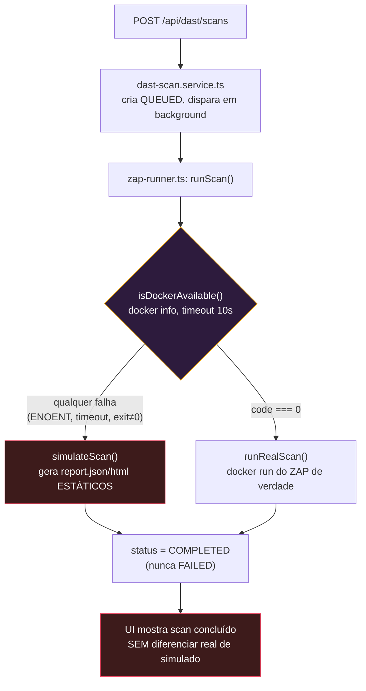

# DAST-DOCKER-GAP.md — Por que o scan real cai para simulado dentro da stack Docker

> ## ✅ RESOLVIDO EM 2026-09-09 — leia este relatório como histórico
>
> As três causas e a lacuna de produto descritas abaixo **foram todas
> corrigidas**. A decisão e o desenho final estão em
> `docs/Vulnera/07-Decisoes/ADR-031 - ZAP em modo daemon por scan e DooD na stack Docker.md`.
> Resumo do que mudou, na numeração deste relatório:
>
> | Item | Situação hoje |
> |---|---|
> | Causa 1 (sem `docker` na imagem) | Resolvida — `app/api/Dockerfile` instala `docker-cli`. |
> | Causa 2 (socket não montado) | Resolvida — `docker-compose.yml` monta `/var/run/docker.sock`; o usuário `vulnera` entra no GID 0 pra ter permissão. |
> | Causa 3 (caminho do bind mount) | **Deixou de existir**: o runner não usa mais volume pra relatório. O ZAP roda em modo daemon e a API baixa `report.json`/`report.html` pela API HTTP dele (`/OTHER/core/other/…`), gravando no próprio disco. Não há mais caminho pra traduzir. |
> | §5 (estado "simulado" invisível) | Resolvida — colunas `simulated`/`warningMessage`/`progress`/`phase` no `DastScan`, expostas no DTO, com selo e alerta na UI e `console.warn` no servidor. |
> | §6 Opção A (API fora do container) | Continua funcionando, mas **não é mais necessária** — o runner detecta os dois modos por `DAST_ZAP_NETWORK`. |
> | §7 Recomendação | Superada: o requisito de **percentual de progresso na UI** (pedido em 2026-09-09) é impossível com `zap-full-scan.py`, que não expõe progresso nenhum — foi o que motivou o modo daemon. |
>
> Uma armadilha nova, descoberta ao implementar e não prevista aqui: o ZAP em
> daemon é um *proxy* antes de ser servidor de API, e devolve `502` se o header
> `Host` não bater com o endereço **e a porta** em que ele escuta. Detalhes no
> ADR-031 e no cabeçalho de `zap-runner.service.ts`.
>
> ### Verificação independente em 2026-09-09 (sessão seguinte)
>
> As correções acima foram **medidas na stack real**, não aceitas no papel:
> `docker compose exec api which docker` responde `/usr/bin/docker`; três
> scans disparados juntos produziram **exatamente dois containers do ZAP** no
> `docker ps` e um na fila com alerta; três scans reais concluíram em 39-52s
> com `simulated: false`.
>
> **Um buraco novo apareceu nessa medição, e não era visível no papel:** o
> watchdog limitava *quantos* scans rodam, mas **nada limitava quanto cada um
> consome** — dois scans reais ocupavam ~960% de 1200% de CPU e cresciam sem
> teto de RAM (`936MiB / 7.7GiB` e `1.39GiB / 7.7GiB`, onde 7.7GiB é a VM
> inteira do Docker). Corrigido com `DAST_ZAP_MEMORY`/`DAST_ZAP_CPUS` +
> `-Xmx` derivado. Ver [[ADR-032 - Triagem, promocao para Vulnerability e comparacao de scans DAST]] §4.
>
> ⚠️ **Resíduo do §5 que vale saber ao demonstrar:** a coluna `simulated` foi
> criada com `DEFAULT false`, então **todo scan anterior a 2026-09-09 aparece
> como real**, inclusive os que de fato foram simulados. Dá pra reconhecê-los
> pela duração de ~3s (o `SIMULATE_DELAY_MS`) e pelos 8 alertas fixos do
> gerador. Não foi feito backfill: o custo de adivinhar retroativamente é
> maior que o de saber disto. Se atrapalhar a demonstração, o caminho limpo é
> apagar os scans antigos em vez de tentar reclassificá-los.

> Relatório de diagnóstico, não um ADR de decisão já tomada. Escrito em
> 2026-09-06, depois de subir a stack completa (`docker compose up --build`,
> porta de entrada `8086`) e constatar que um scan disparado pela UI "funciona"
> mas usa dados simulados em vez de rodar o ZAP de verdade.
>
> Todas as causas abaixo foram **confirmadas lendo o código e a configuração
> reais**, não deduzidas por suposição — cada seção cita o arquivo e a linha.

---

## 1. Resumo executivo

**O sintoma "Docker indisponível" não é um erro que aparece na tela.** O
módulo DAST foi desenhado para nunca travar: se `docker info` falhar, ele cai
**silenciosamente** para um gerador de relatório simulado
(`simulateScan()`), e o scan "completa" normalmente na interface — sem
nenhum aviso visual, nenhum log de servidor, nenhum campo salvo no banco.
A única pista é abrir o relatório gerado e ler, dentro dele,
`"ZAP (simulado — Docker indisponível)"`.

Isso quer dizer que **o produto está se comportando exatamente como foi
projetado** — só que o cenário em que ele está rodando agora
(`docker compose up --build`, API dentro de um container) nunca tinha sido
testado com scan real antes desta sessão. Todos os scans reais que existem
como evidência (`docs/evidencias/dast/`) foram feitos com a API rodando
**localmente** (`npm run dev`), fora de qualquer container.

Existem **três causas técnicas encadeadas** — corrigir só a primeira não
resolve o problema, ela só revela a segunda, que revela a terceira — mais
**uma lacuna de produto** (nenhuma sinalização de que o scan foi simulado).
Nenhuma foi corrigida neste relatório: é um diagnóstico, a decisão de qual
caminho seguir fica com o Rafael (ver §5).

---

## 2. O que realmente acontece (ordem de execução)



Trecho exato que decide isso (`app/api/src/services/zap-runner.service.ts`,
função `runScan`):

```ts
export async function runScan(options: RunScanOptions): Promise<ScanOutcome> {
  const forceSimulate = EnvVar.getOptional(EnvKeys.DAST_FORCE_SIMULATE, "false").toLowerCase() === "true";
  const dockerOk = !forceSimulate && (await isDockerAvailable());
  const timeoutMs = options.timeoutMs ?? getTimeoutMs();
  if (!dockerOk) {
    return simulateScan(options.scanId, options.targetUrl, timeoutMs);
  }
  return runRealScan(options.scanId, options.targetUrl, timeoutMs);
}
```

Isto é **intencional e documentado** (`docs/DAST.md` §4, cabeçalho do
próprio arquivo): o fallback existe para que o CI e ambientes sem Docker
continuem exercitando o pipeline de ponta a ponta. O problema não é a
existência do fallback — é que ele está sendo acionado num ambiente
(a stack Docker completa) onde a intenção era rodar de verdade.

---

## 3. As três causas raiz, em cadeia

### Causa 1 — o binário `docker` não existe dentro da imagem da API

`app/api/Dockerfile` usa `node:22-alpine` e instala apenas o necessário
para compilar o `bcrypt`:

```dockerfile
RUN apk add --no-cache python3 make g++
```

**Não há `apk add docker-cli`.** Quando `isDockerAvailable()` chama
`execFile("docker", ["info"], ...)` de dentro do container da API, o
sistema operacional do container não encontra o executável — o processo
falha com `ENOENT` antes mesmo de tentar falar com um daemon. Isso sozinho
já é suficiente para todo scan cair em `simulateScan()`.

**Como confirmar:** `docker compose exec api which docker` retorna vazio
(comando não encontrado).

### Causa 2 — mesmo com o CLI instalado, não há socket para ele conversar

`docker-compose.yml`, serviço `api`:

```yaml
volumes:
  - vulnera-api-uploads:/app/uploads
```

Só o volume de uploads. **Nenhum socket do Docker do host está montado.**
Para um container conseguir orquestrar containers *irmãos* no mesmo host
(o padrão chamado "Docker outside of Docker", DooD — é exatamente o que o
`ADR-028` já usa: um container por scan, nunca aninhado), ele precisa
enxergar o socket do daemon do host, normalmente montado como:

```yaml
volumes:
  - /var/run/docker.sock:/var/run/docker.sock
```

Sem isso, mesmo com o CLI instalado (Causa 1 corrigida), `docker info`
teria êxito em *executar*, mas falharia ao *conectar* — o resultado prático
para `isDockerAvailable()` é o mesmo: `code !== 0`, cai no simulado.

### Causa 3 — mesmo com as duas primeiras resolvidas, o caminho do volume não bate (a mais sutil)

Esta é a causa que **só aparece depois** de corrigir as duas primeiras, e é
o motivo de este relatório recomendar cautela antes de simplesmente "montar
o socket e seguir": mesmo funcionando, o resultado seria um scan que
completa, mas nunca encontra o `report.json`, e falha com uma mensagem
confusa.

`app/api/src/services/zap-runner.service.ts`, função `runRealScan`:

```ts
function getReportsDir(): string {
  return path.resolve(process.cwd(), EnvVar.getOptional(EnvKeys.DAST_REPORTS_DIR, "dast-reports"));
}
// ...
const reportsDir = getReportsDir();
const scanDir = path.resolve(reportsDir, scanId);
// ...
const hostDir = scanDir; // ⚠️ comentário no código já avisa: "caminho nativo do
                          // Windows... quando quem chama é o Node" — mas isso
                          // só é verdade quando o NODE roda no HOST, não dentro
                          // de um container.
const args = ["run", "--rm", "--name", containerName, "-v", `${hostDir}:/zap/wrk/:rw`, ZAP_IMAGE, ...];
```

Quando a API roda **dentro do container**, `process.cwd()` resolve para
algo como `/app` (o `WORKDIR` do `Dockerfile`), então `hostDir` vira
`/app/dast-reports/<scanId>` — um caminho que só existe **dentro do
container da API**.

O comando `docker run -v /app/dast-reports/<scanId>:/zap/wrk/:rw ...` não é
executado pelo container da API — ele é apenas **enviado via socket** para
o daemon do **host**, que interpreta esse caminho no **contexto do host**
(ou, no caso do Docker Desktop com backend WSL2, no contexto da VM Linux
que o Docker Desktop gerencia — que não é o filesystem do container `api`).
O resultado típico é o Docker criar silenciosamente um diretório vazio
nesse caminho (dentro da VM do Docker Desktop) e montá-lo no container do
ZAP — o ZAP escreve `report.json` ali, num lugar que a API **nunca vai
olhar**, porque a API está procurando o arquivo no seu próprio
`/app/dast-reports/<scanId>` (que é outro diretório, dentro do container da
API).

Resultado: o scan seria classificado como `FAILED` com a mensagem genérica
`"docker saiu com código 0 sem gerar report.json"` — nem `TIMEOUT` nem
`DOCKER_UNAVAILABLE`, um terceiro sintoma que confundiria ainda mais o
diagnóstico se as Causas 1 e 2 fossem corrigidas isoladamente.

---

## 4. Por que isso nunca foi pego antes

Não é regressão de nenhuma sessão anterior — é a **primeira vez** que este
par de features é exercitado junto. Evidência no próprio `docs/DAST.md`
(escrito na Fase 9, antes de a stack Docker completa existir com o formato
atual):

> "Caminho de volume no Windows quebra quando invocado via Git Bash/MSYS...
> **Isso NÃO afeta o runner de produção** — Node's `execFile` chama
> `docker.exe` diretamente, sem passar por nenhum shell MSYS."

Essa nota já demonstra a suposição implícita em todos os testes da Fase 9:
o processo Node do `zap-runner.service.ts` sempre rodou **no host**,
nunca dentro de um container. Os dois scans reais documentados em
`docs/evidencias/dast/` (contra `example.com` e o Juice Shop) foram feitos
nesse modo. A combinação "API em container + scan real" só passou a ser
possível depois que a sessão anterior encapsulou a stack inteira com
`docker compose up --build` e porta `8086` — e ninguém tinha rodado um
scan de verdade nesse modo específico ainda.

---

## 5. Lacuna de produto — o estado "simulado" é invisível

Independente da causa técnica, há um problema de UX que vale corrigir
mesmo antes (ou além) de resolver o DooD: **nada informa ao usuário que o
scan que ele acabou de rodar não é real.**

Confirmado por grep — zero ocorrências da palavra `simulated` fora do
próprio `zap-runner.service.ts`:

| Onde deveria aparecer e não aparece | Situação real |
|---|---|
| `dast-scan.service.ts` | Lê `outcome.simulated` do retorno de `runScan()`? **Não.** O campo é descartado — só `status`/`errorMessage`/paths são usados. |
| `schema.prisma` (`DastScan`) | Existe coluna `simulated`? **Não.** |
| Resposta da API (`GET /scans/:id`) | Devolve alguma flag indicando simulação? **Não.** |
| `dast-page.tsx` / `dast-scan-detail-page.tsx` | Algum aviso visual (badge, banner)? **Não** — grep confirma zero menção a "simulad" nos dois arquivos. |
| Log do servidor (`console.*`) | Algum aviso no boot ou por scan? **Não** — o único `console.error` existente no service é para exceção não tratada, que não é o caso do fallback (ele retorna normalmente). |

Ou seja: um scan simulado e um scan real são **indistinguíveis** em toda a
aplicação, exceto abrindo o `report.json`/`report.html` e lendo o texto
`"(simulado — Docker indisponível)"` escrito dentro do conteúdo do
relatório.

---

## 6. Caminhos de solução

### Opção A — Rodar a API fora do container só para usar o DAST (contorno imediato, zero mudança de código)

O próprio `ADR-022` já documenta e mantém este modo como suportado:

```bash
docker compose up -d db mailhog    # só a infra
cd app/api && npm run dev          # API local, acessa o Docker do host direto
```

Nesse modo, `execFile("docker", ...)` roda no host de verdade — é
exatamente o cenário em que os dois scans reais documentados em
`docs/evidencias/dast/` funcionaram. **Nenhuma das três causas acima se
aplica.** O custo é abrir mão de "tudo num container" enquanto for usar o
DAST — mas banco, Mailhog e (se quiser) o `web` continuam em container
normalmente.

**Recomendado como resposta imediata** enquanto a Opção B não for
implementada — é literalmente reverter para um modo já testado e já
documentado, sem escrever uma linha de código nova.

### Opção B — Resolver o DooD de verdade, mantendo tudo em container

Três mudanças, na ordem em que as causas foram descritas:

**1. Instalar o CLI do Docker na imagem da API** (`app/api/Dockerfile`):

```dockerfile
RUN apk add --no-cache python3 make g++ docker-cli
```

**2. Montar o socket do host** (`docker-compose.yml`, serviço `api`):

```yaml
volumes:
  - vulnera-api-uploads:/app/uploads
  - /var/run/docker.sock:/var/run/docker.sock
```

⚠️ **Problema de permissão que isso introduz**: o `Dockerfile` da API cria
um usuário não-root (`vulnera`) e roda o processo com `USER vulnera`. O
socket do Docker no host normalmente pertence ao grupo `docker` (ou root)
com permissão `srw-rw----`. Um usuário sem esse GID dentro do container
recebe `permission denied` ao tentar usar o socket, **mesmo montado
corretamente**. Duas saídas, nenhuma limpa:
  - rodar o container da API como root (reverte a boa prática de segurança
    que o próprio `Dockerfile` implementou);
  - ou descobrir o GID do grupo dono do socket no host e recriar o usuário
    `vulnera` com esse GID — frágil, porque o GID do Docker Desktop pode
    mudar entre instalações/hosts, então isso quebraria em qualquer máquina
    diferente da atual.

**3. Corrigir a tradução de caminho do bind mount** — a parte que exige
mudança de lógica, não só de configuração. É preciso que a API, mesmo
rodando em `/app` internamente, monte o argumento `-v` do `docker run` do
ZAP usando o caminho **do host**, não o caminho interno do container.
Isso exige:

  - Montar o diretório de relatórios como *bind mount* explícito (não
    calculado por `process.cwd()`), igual ao volume de uploads:
    ```yaml
    volumes:
      - vulnera-api-uploads:/app/uploads
      - ./app/api/dast-reports:/app/dast-reports
      - /var/run/docker.sock:/var/run/docker.sock
    ```
  - Uma variável de ambiente **nova**, algo como `DAST_REPORTS_HOST_DIR`,
    apontando para o caminho absoluto **do host** (`docker-compose.yml`
    conhece esse caminho — é o lado esquerdo do bind mount acima).
  - Ajustar `zap-runner.service.ts` para usar `DAST_REPORTS_HOST_DIR`
    (quando definida) ao montar o argumento `-v` do container do ZAP,
    mantendo `getReportsDir()` (caminho interno) para todas as operações
    de `fs.*` — os dois precisam apontar para o **mesmo diretório físico**,
    só que descrito de duas formas diferentes (uma para o processo Node
    local, outra para o daemon do host).

  Esboço da mudança (não aplicada — este documento é diagnóstico):

  ```ts
  // zap-runner.service.ts
  function getReportsHostDir(scanId: string): string {
    const hostBase = EnvVar.getOptional(EnvKeys.DAST_REPORTS_HOST_DIR, "");
    if (hostBase) return path.resolve(hostBase, scanId); // caminho que o DAEMON entende
    return path.resolve(getReportsDir(), scanId);          // fallback: API roda no host mesmo
  }
  // runRealScan usa getReportsHostDir(scanId) no argumento -v,
  // e continua usando getReportsDir() (interno) pros fs.mkdir/fs.readFile/fs.access.
  ```

**Risco de segurança adicional que a Opção B introduz** (não existia
quando a API rodava localmente): o socket do Docker passa a estar
acessível **de dentro de um container que também serve tráfego HTTP de
rede**. O `ADR-028` já assumia o risco de "a API ter acesso ao Docker do
host" — mas rodando localmente, comprometer a API significava comprometer
o processo Node no host, que já tinha o mesmo nível de acesso ao usuário
que a rodava. Rodando em container, o socket montado significa que
**escapar do container da API** (via alguma vulnerabilidade não relacionada
ao DAST) dá controle root do host inteiro através do Docker — a superfície
de escalada é maior. Vale reavaliar o `ADR-028` explicitamente antes de
adotar a Opção B em qualquer ambiente que não seja a máquina de
desenvolvimento local.

### Opção C — Daemon Docker dedicado / sidecar (mencionada, não detalhada)

Um serviço separado, dedicado só a executar comandos Docker sob demanda
(um pequeno daemon HTTP interno, ou Docker-in-Docker isolado), removeria a
necessidade de a própria API tocar no socket do host. Resolve o risco de
segurança da Opção B, mas é uma peça de infraestrutura nova, desproporcional
ao volume do produto (mesmo raciocínio já usado no `ADR-030` para descartar
fila). **Fora de escopo deste relatório** — citada só para registrar que
existe, caso o produto cresça a ponto de justificá-la.

### Corrigir a lacuna de produto (§5), independente da opção escolhida

Vale fazer isso mesmo que a Opção A seja adotada como resposta imediata:

- Persistir `simulated: boolean` em `DastScan` (migration pequena).
- Expor no DTO de resposta da API.
- Badge/aviso visível na UI ("Este scan usou dados simulados — Docker não
  estava disponível no momento da execução").
- `console.warn` no momento em que `runScan()` decide simular, para que o
  log do servidor também deixe rastro.

---

## 7. Recomendação

Para a demonstração e para o TCC, **Opção A é a recomendação direta**: já
está documentada, já foi validada com dois scans reais, e não introduz o
risco de segurança adicional da Opção B. Rodar `db`+`mailhog` (e
opcionalmente `web`) em container e a API localmente via `npm run dev`
quando for demonstrar o módulo DAST resolve o problema sem escrever
código novo.

A Opção B é o caminho correto **se e somente se** "tudo em um único
`docker compose up`" for um requisito não-negociável — nesse caso, as três
mudanças de §6 precisam ser feitas **juntas** (fazer só a primeira ou as
duas primeiras produz um sintoma novo e mais confuso do que o atual) e o
`ADR-028` precisa de uma atualização explícita reconhecendo o aumento de
superfície de risco.

A correção da lacuna de produto (§5) é barata e vale a pena
independentemente da opção escolhida — é o tipo de achado que, não
corrigido, poderia ser confundido pela própria banca com "o scanner não
funciona", quando na verdade ele está funcionando exatamente como
projetado.

---

## Referências

- `app/api/src/services/zap-runner.service.ts` — `isDockerAvailable`,
  `runRealScan`, `simulateScan`, `runScan`
- `app/api/src/services/dast-scan.service.ts` — descarta `outcome.simulated`
- `app/api/Dockerfile` — sem `docker-cli`
- `docker-compose.yml` — serviço `api`, sem socket montado
- `docs/DAST.md` §4 (comando exato do Docker), §9 (solução de problemas
  conhecidos antes desta sessão)
- `docs/Vulnera/07-Decisoes/ADR-028 - Execucao do ZAP via Docker spawn.md`
  — risco do socket já discutido no contexto de API rodando localmente
- `docs/evidencias/dast/README.md` — os dois scans reais, ambos com a API
  rodando fora de container

---

# PARTE II — Relatório de execução e ponto de parada (2026-09-09)

> Escrito ao fim da sessão que **implementou** as correções, a pedido do
> Rafael, para permitir retomar exatamente daqui. A Parte I acima é o
> diagnóstico original (2026-09-06) e continua valendo como histórico.

## A. O que foi pedido nesta sessão

Textualmente: *"faça o scan real, faça o container do OWASP ZAP proxy spawnar e
faz o scan, adiciona um watch dog para limitar em no máximo 2 scans por vez e
avisar se der erro, quero um tracking da % de progressão na UI (caso falhe,
gere uma mensagem amigável e mantenha o resultado simulado)"*.

Cinco entregas, portanto: **(1)** scan real; **(2)** container do ZAP criado
sob demanda; **(3)** watchdog com teto de 2 e aviso de erro; **(4)** % de
progresso na UI; **(5)** fallback simulado com mensagem amigável.

## B. Estado: as cinco entregas estão prontas e validadas

| # | Entrega | Estado | Como foi provado |
|---|---|---|---|
| 1 | Scan real | ✅ | `https://example.com` em **47s** no modo host, `simulated:false`, **7 alertas reais** do ZAP 2.17.0 (CSP ausente, anti-clickjacking, HSTS, nosniff, cache…). E **dentro da stack**, ver o log em §B.1 |
| 2 | Container por scan | ✅ | `docker run -d --rm --name vulnera-zap-<scanId> … zap.sh -daemon`; removido no `finally` com `docker rm -f` |
| 3 | Watchdog máx. 2 + aviso | ✅ | Na stack: 3 scans disparados juntos → `rodando=2/2 fila=1` estável por 134s, e o terceiro só arrancou quando o primeiro terminou; 10 testes unitários (DAST-WD-01..07) |
| 4 | % de progresso | ✅ | Percentual **do próprio ZAP** por fase, persistido e exibido; observado percorrendo 1% → 4% → 69% → 89% → 100% com a fase indo de STARTING a DONE |
| 5 | Fallback amigável | ✅ | Falha real → resultado simulado mantido, `simulated:true` + `warningMessage` em PT-BR. Testado nos 4 modos de falha |

**Checagens verdes:** backend `lint` 0 erros, **333/333 testes** (eram 315);
frontend `lint` 0 erros (8 warnings pré-existentes de `react-refresh`),
**34/34 testes**; `tsc --noEmit` limpo nos dois workspaces.

### B.1 — Log da validação end-to-end na stack Docker

Três scans reais disparados juntos contra `example.com`, `example.org` e
`example.net`, via `POST /api/dast/scans` na stack `docker compose`, com o
watchdog em `DAST_MAX_CONCURRENT_SCANS=2`:

```
criado: cmtu5t0dz0005qo01w2ph942s -> https://example.com (status=QUEUED)
criado: cmtu5t0gx0009qo01j8i7xfj1 -> https://example.org (status=QUEUED)
criado: cmtu5t0j0000dqo013mm3r9s3 -> https://example.net (status=QUEUED)
[ 10s] rodando=2/2 fila=1 :: .com RUNNING/1%/STARTING  | .org RUNNING/1%/STARTING  | .net QUEUED/0%/QUEUED
[ 30s] rodando=2/2 fila=1 :: .com RUNNING/4%/STARTING  | .org RUNNING/4%/STARTING  | .net QUEUED/0%/QUEUED
[ 41s] rodando=2/2 fila=1 :: .com RUNNING/69%/ACTIVE   | .org RUNNING/66%/ACTIVE   | .net QUEUED/0%/QUEUED
[123s] rodando=2/2 fila=1 :: .com RUNNING/89%/ACTIVE   | .org RUNNING/89%/ACTIVE   | .net QUEUED/0%/QUEUED
[134s] rodando=2/2 fila=0 :: .com COMPLETED/100%/DONE  | .org RUNNING/96%/ACTIVE   | .net RUNNING/0%/STARTING   <-- vaga liberada puxou o da fila
[154s] rodando=1/2 fila=0 :: .com COMPLETED/100%/DONE  | .org COMPLETED/100%/DONE  | .net RUNNING/55%/ACTIVE

=== RESULTADO FINAL (todos simulated=False) ===
https://example.com/ :: COMPLETED 100% DONE  med=2 low=5 info=4  133100ms
https://example.org/ :: COMPLETED 100% DONE  med=3 low=5 info=4  135440ms
https://example.net/ :: COMPLETED 100% DONE  med=3 low=5 info=4   51538ms
```

Três coisas ficam provadas de uma vez neste log: **o scan é real dentro do
container** (`simulated=False` com achados diferentes por alvo), **o teto de 2
é respeitado** (`rodando=2/2 fila=1` até os 134s), e **o percentual é
verdadeiro** (o `.net`, que rodou praticamente sozinho, levou 51s contra os
133s dos dois que dividiram a máquina — e a barra de cada um acompanhou isso).

## C. Como o problema foi resolvido (e por que não do jeito que a Parte I sugeria)

A Parte I recomendava a **Opção A** (rodar a API fora do container). Ela foi
descartada por um motivo que não existia em 2026-09-06: **o requisito de
percentual de progresso**. `zap-full-scan.py` é uma caixa preta — devolve texto
no stdout só ao terminar, sem percentual nenhum. Qualquer barra construída
sobre ele seria estimativa de tempo fingindo ser medição.

A solução foi trocar o modo de execução do ZAP: **um container por scan, como
sempre, mas em modo daemon**, conduzido pela API HTTP do próprio ZAP. Isso
resolveu três coisas de uma vez:

- **Progresso real** — `/JSON/spider/view/status/` e `/JSON/ascan/view/status/`
  devolvem 0..100 de verdade.
- **A Causa 3 desapareceu do desenho** (não foi contornada): os relatórios
  chegam por `/OTHER/core/other/jsonreport/` e quem grava em disco é o processo
  Node, no mesmo caminho que ele depois lê. **Não existe mais bind mount de
  relatório**, então não existe mais caminho host↔container pra traduzir, nem a
  variável `DAST_REPORTS_HOST_DIR` que a Parte I §6 esboçava.
- **Causas 1 e 2** foram resolvidas como a Parte I desenhou: `docker-cli` na
  imagem e socket do host montado.

### ⚠️ A armadilha que consumiu a maior parte da sessão (não estava prevista)

**O ZAP em daemon é um proxy antes de ser um servidor de API.** Ele só trata a
requisição como "para mim" quando o header `Host` bate com o endereço **e a
porta** em que ele mesmo escuta. Qualquer outra coisa ele tenta encaminhar e
devolve **`502 Bad Gateway`**.

Consequência prática: publicar uma porta efêmera (`-p 127.0.0.1::8080`) **não
funciona** — a requisição chega com `Host: 127.0.0.1:50866` e o ZAP tenta
proxiar pra si mesmo na 50866, onde não há ninguém. As duas saídas adotadas:

- **API em container**: mesma rede (`vulnera-net`), endereço
  `http://vulnera-zap-<scanId>:8080` — porta 8080 dos dois lados.
- **API no host**: o runner escolhe uma porta livre e usa **a mesma dentro e
  fora** (`-p 127.0.0.1:P:P` + `zap.sh -port P`), presa ao loopback.

Se um dia alguém "simplificar" isso de volta pra porta efêmera, o sintoma será
todo scan caindo no simulado com `ZAP_STARTUP_TIMEOUT` após 3 minutos.

## D. Arquivos tocados

**Backend — `app/api/`**

| Arquivo | O que mudou |
|---|---|
| `src/services/zap-runner.service.ts` | **Reescrita do miolo.** `runRealScan` agora sobe o daemon e conduz spider→passivo→ativo→relatório pela API HTTP; novos `buildZapUrl`, `zapJson`, `httpGet`, `resolveZapEndpoint`, `findFreePort`, `getDockerStatus` (cache de 30s), `SCAN_PHASE_LABELS`, `FALLBACK_MESSAGES`, `friendlyFailureReason`. `runScan` ganhou o fallback simulado. **Preservados sem alteração**: `validateTargetUrl`, `isPrivateOrLoopbackHost`, `resolveReportPath`, `readReportFile`, `simulateScan`, `killContainer` |
| `src/services/dast-watchdog.service.ts` | **Arquivo novo.** Fila FIFO, teto de concorrência, abort por falta de pulso, anel de 20 alertas, `snapshot()`. Exporta a classe (pra teste) e o singleton `dastWatchdog` |
| `src/services/dast-scan.service.ts` | `create()` enfileira no watchdog em vez de disparar; `runInBackground(scanId, ctx)` recebe contexto do watchdog; `makeProgressSink()` (pulso + escrita com throttle); `getStatus(actor)` novo; `cancel()` aborta no watchdog; `markFinished` grava `simulated`/`warningMessage`/`progress`/`phase` |
| `src/controllers/dast-scan.controller.ts` | `getStatus()` novo |
| `src/routes/dast-scan.routes.ts` | `GET /status` **antes** de `GET /:id` |
| `src/factories/dast-scan.factory.ts` | Injeta o singleton `dastWatchdog` |
| `src/models/dast-scan.model.ts` | DTO ganhou `progress`, `phase`, `simulated`, `warningMessage` |
| `src/repositories/dast-scan.repository.ts` | `UpdateDastScanInput` ganhou os 4 campos |
| `src/config/enum/EnvKeys.ts` | +5 chaves (`DAST_ZAP_NETWORK`, `DAST_MAX_CONCURRENT_SCANS`, `DAST_ZAP_STARTUP_TIMEOUT_MS`, `DAST_ZAP_SPIDER_MAX_DURATION_MIN`, `DAST_HEARTBEAT_TIMEOUT_MS`) |
| `prisma/schema.prisma` + migration `20260909131426_add_dast_progress_and_simulated_flag` | 4 colunas novas em `DastScan` |
| `Dockerfile` | `apk add … docker-cli`; `addgroup vulnera root`; `mkdir dast-reports` |
| `.env.example` | Documenta as 5 chaves novas + `DAST_FORCE_SIMULATE` |
| `.env` / `.env.test` *(não versionados)* | Bloco DAST acrescentado; **`.env.test` ganhou `DAST_FORCE_SIMULATE=true`** (ver §F) |

**Frontend — `app/web/`**

| Arquivo | O que mudou |
|---|---|
| `src/components/dast/dast-status-banner.tsx` | **Arquivo novo.** Hook `useDastStatus` + banner (motor, vagas, fila, alertas) |
| `src/pages/dast-page.tsx` | Banner no topo; `StatusCell` com barra de progresso + selo "simulado" + posição na fila; polling 5s → 3s |
| `src/pages/dast-scan-detail-page.tsx` | Bloco de progresso (barra + fase + tempo + posição na fila) no lugar do alerta antigo; alerta de resultado simulado; selo no cabeçalho; polling 3s |
| `src/lib/api/dast.api.ts` | `getStatus()` |
| `src/types/dast.types.ts` | Campos novos em `DastScan`; `DastModuleStatus` + tipos do watchdog; `DAST_PHASE_LABELS` + `labelDaFase()` |

**Raiz**: `docker-compose.yml` (socket, rede `vulnera-net`, volume
`vulnera-api-dast-reports`, variáveis do DAST).

**Testes**: `tests/unit/zap-runner.service.test.ts` (bloco do caminho real
reescrito, mock de `child_process` **e** `http`; SEC-01..05 intactos),
`tests/unit/dast-watchdog.service.test.ts` (novo, 10 casos),
`tests/integration/dast.test.ts` (+4 casos; RBAC agora cobre 8 rotas).

**Docs**: `ADR-031` (novo), nota de substituição parcial no `ADR-028`,
`docs/DAST.md` (§2 diagrama, §4 comando e sequência, §6 modelo, §7 config, §9
troubleshooting), este arquivo, `PRD_VIVO.md` (FEAT-09.1), `docs/BACKLOG.md`
(FASE 9.1).

## E. Como retomar / verificar

```bash
# 1. Stack completa (é o modo que estava quebrado e agora funciona)
docker compose up -d --build
docker compose exec api npm run db:seed          # admin@vulnera.local / admin12345

# 2. Prova de que o Docker chega na API (era a Causa 1+2)
docker compose exec api docker info --format "{{.ServerVersion}}"   # -> 29.5.2

# 3. Pela UI: http://localhost:8086  ->  /dast  ->  "Novo scan"
#    O banner do topo diz "Motor: OWASP ZAP via Docker" e "Em execução: 0/2".

# 4. Suíte
cd app/api && npm run check      # 333 testes
cd app/web && npm run check      # 34 testes
```

Para rodar **fora** do container (modo host, também suportado): deixe
`DAST_ZAP_NETWORK` vazio no `.env` e use `npm run dev` — o runner publica a
porta do ZAP em 127.0.0.1 sozinho.

## F. Pré-requisitos de ambiente que precisaram ser consertados

Não eram bugs do módulo, mas deixavam a suíte **inteira** vermelha (221
falhas) antes de qualquer código novo:

1. **`.env.test` não tinha `DAST_FORCE_SIMULATE=true`**, apesar de o cabeçalho
   do `dast.test.ts` afirmar que tinha. Corrigido (o arquivo não é versionado,
   então isso pode acontecer de novo em outra máquina — o `.env.example` agora
   documenta a variável).
2. **O banco `vulnera_test` não existia com as tabelas do DAST.** Resolvido com
   `CREATE DATABASE vulnera_test` + `GRANT` + `prisma migrate deploy` apontando
   pra ele.

## G. O que NÃO foi feito (pendências conhecidas)

| Item | Situação |
|---|---|
| **Commit / PR** | ⚠️ **Nada foi commitado.** Tudo está na working tree da branch `feat/dast-zap`, seguindo a instrução histórica do prompt original da Fase 9 (o Rafael decide quando commitar) |
| **Validação visual da UI nova em navegador** | ❌ **A maior pendência.** As telas foram validadas por tipo (`tsc`), lint e testes, e o comportamento por trás delas foi provado pela API (§B.1), mas **ninguém olhou a barra de progresso, o banner e o selo "simulado" renderizados**. É o primeiro passo ao retomar: `http://localhost:8086` → login `admin@vulnera.local` / `admin12345` → `/dast` → "Novo scan". Um scan leva ~1min, tempo de sobra pra ver a barra andar |
| Evidência em `docs/evidencias/dast/` | ❌ O scan real desta sessão não foi copiado pra lá (os dois da Fase 9 continuam). Vale anexar um relatório novo, já do runner em modo daemon |
| `docs/ROADMAP_PROMPTS.md` | ❌ Não atualizado — a Fase 9.1 não tem prompt lá (veio direto no chat). Se for tratada como fase formal, precisa de seção + histórico (CLAUDE.md R3) |
| `Changelog do Projeto.md` | ❌ Não atualizado (R3 pede no fim da fase; a fase está em revisão, não fechada) |
| Cobertura ≥80% nos services novos | ❓ Não medida nesta sessão (`npm run test:coverage` não foi rodado). O watchdog tem 10 testes e o runner 24; a expectativa é folgada, mas **não está confirmada por número** |
| Host Linux | ⚠️ O `addgroup vulnera root` do Dockerfile resolve o Docker **Desktop** (socket `root:root`). Em Linux o socket costuma ser `root:docker` — lá o certo é `group_add` no compose com o GID local. Documentado no Dockerfile e no ADR-031, **não testado** |
| Reavaliação de segurança do socket | ✅ documentada no ADR-031 §2, ⚠️ mas é uma decisão que vale o Rafael ler com atenção antes de qualquer coisa que não seja máquina de desenvolvimento |

## H. Estado da máquina ao parar

- Stack `docker compose` **de pé** (`vulnera-db`, `vulnera-api`, `vulnera-web`,
  `vulnera-mail`), rede `vulnera-net`, banco semeado.
- Imagem `ghcr.io/zaproxy/zaproxy:stable` (~1,5GB) **baixada** — o primeiro
  scan não vai mais travar minutos "silenciosamente".
- Banco `vulnera_test` criado e migrado.
- Podem ter ficado containers `vulnera-zap-*` de pé se a validação final foi
  interrompida no meio: `docker ps --filter name=vulnera-zap` mostra, e
  `docker rm -f $(docker ps -q --filter name=vulnera-zap)` limpa.
