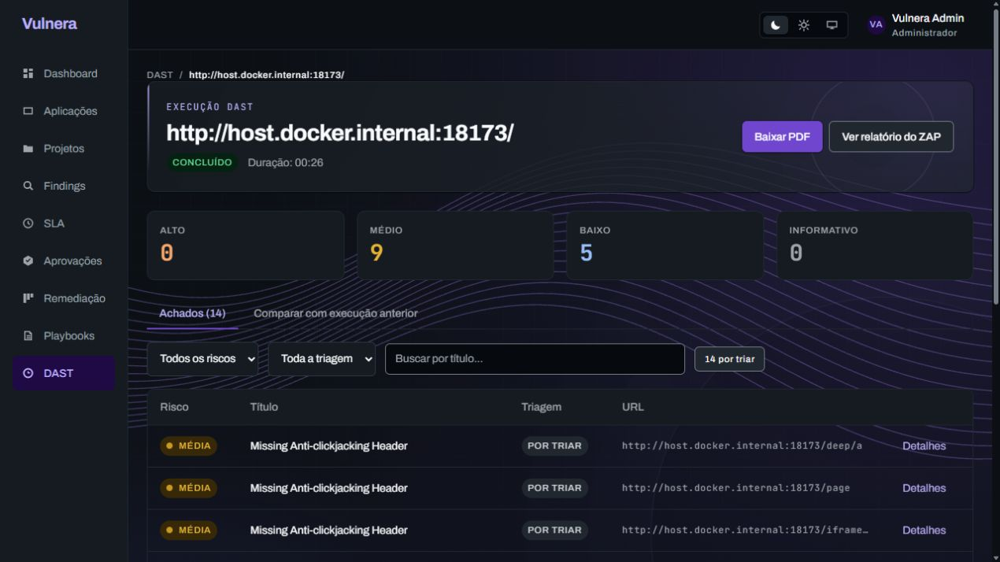
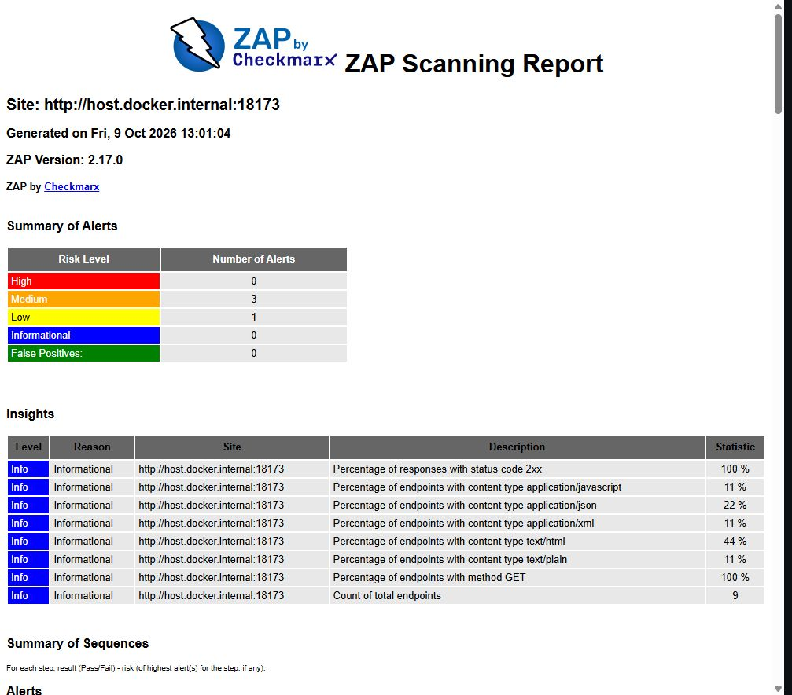
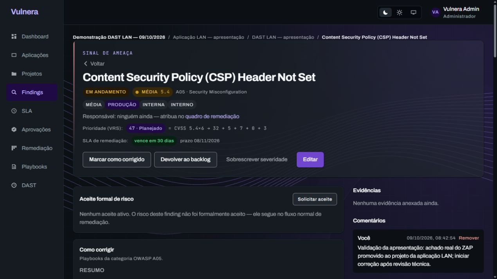

<!-- Registra a prova do Spider, dos relatórios e do README; existe como evidência reproduzível para mantenedores e banca. -->

# Spider DAST e README — validação de 09/10/2026

**✅ Concluída em 2026-10-09 — 100% (4/4 entregas).** Continuação na branch
`codex/fix-dast-network-targets`, [PR #58](https://github.com/guimunizzz/Vulnera-TCC/pull/58)
em rascunho para `dev`, sem merge. ADR-046 registra a decisão.

## Comportamento implementado

O perfil anterior usava `core/accessUrl` e extraía somente links `<a href>`
entre aspas. A fase tinha nome SPIDER, mas não iniciava o Spider do ZAP.
O Real agora inicia e acompanha o **Spider tradicional**, que descobre
links, recursos, `robots.txt` e sitemap; depois aguarda a fila passiva
esvaziar e gera JSON/HTML reais. Falhas não viram demonstração.

Contexto ancorado limita origem e subárvore, excluindo caminhos sensíveis.
A exclusão própria do Spider impede URLs com query. Forms/POST, JavaScript,
active scan e parsers Git/SVN/DS_Store ficam desligados. Limites: 1 minuto
padrão (configurável em 1..10; zero/inválido volta a 1), profundidade 2,
30 filhos **por nó**, uma thread e parsing de até 1 MB. Não há teto global
de 30 páginas nem intervalo fixo de 250 ms entre requests neste método.

`discovery.json` registra perfil, URLs no escopo e limites por execução.
`GET /api/dast/scans/:id/report/data` devolve os metadados somente após
ownership e validação do artefato. Demo/legado sem registro retornam `null`.
O PDF usa o perfil daquela execução; não atribui Spider a scans antigos.
Nenhum schema, migration, dependência ou lockfile foi alterado.

## Prova em alvo controlado

A URL do colega `10.87.169.107:5173` não respondeu na checagem desta
continuação. A validação usa uma fixture HTTP local, com logs recebidos pelo
alvo. Seus achados não descrevem a aplicação do colega. A prova LAN anterior
permanece em [DAST em rede interna](DAST-REDE-VALIDACAO-2026-10-09.md).

| Campo | Resultado final |
| --- | --- |
| Scan | `cmv0z426m0001mj01c12vh7mx` |
| Alvo | `http://host.docker.internal:18173/` |
| Motor | OWASP ZAP 2.17.0, daemon efêmero em Docker |
| Estado | `COMPLETED`, `simulated=false`, `progress=100`, `phase=DONE` |
| Duração no banco | **26,641 s** (`13:00:38.580Z` → `13:01:05.221Z`) |
| Descoberta | **9 URLs distintas no escopo** |
| Tráfego recebido | **10 requests, todos GET**; a raiz recebe checagem inicial e Spider |
| Achados normalizados | **14: 0 altos / 9 médios / 5 baixos / 0 informativos** |

URLs registradas (a contagem inclui recursos, não só páginas HTML):

```text
/
/assets/site.js
/deep/a
/iframe-only
/page
/robots-only
/robots.txt
/sitemap-only
/sitemap.xml
```

O HTML original do ZAP mostra **4 tipos de alerta** (3 médios/1 baixo).
O Vulnera normaliza as instâncias por URL/parâmetro, totalizando 14 findings.
Esses contadores têm unidades diferentes; não são resultados conflitantes.

| Critério verificado nos logs da fixture | Resultado |
| --- | --- |
| Link sem aspas `/page` | Acessado e registrado |
| Recurso de script `/assets/site.js` | Acessado; JavaScript não executado |
| Iframe `/iframe-only` | Acessado e registrado |
| Endpoint indicado por robots `/robots-only` | Acessado e registrado |
| Endpoint indicado por sitemap `/sitemap-only` | Acessado e registrado |
| Profundidade `/deep/a` / `/deep/b` | Primeiro acessado; segundo não acessado |
| `/search?q=teste` | Zero requests na execução final |
| `/logout`, `/delete-item`, `/submit` | Zero requests |
| Outra origem em porta 18174 | Zero requests |
| Métodos diferentes de GET | Zero requests |

**Correção durante a prova:** a primeira execução
`cmv0yppyx0003l3015mfkih96` concluía com 9 URLs filtradas, mas seu log mostrou
um GET em `/search?q=teste`. O contexto do ZAP compara URLs sem query.
Foi acrescentado `spider/action/excludeFromScan` com `.*\?.*` antes de iniciar
o motor; a repetição acima comprova que esse request não ocorre. A primeira
execução foi preservada como histórico; os prints finais usam a repetição.

## Interface, PDF e documentação

- Navegador real: formulário Real, aviso/autorização, acompanhamento,
  conclusão, findings em outros endpoints e HTML original com 9 endpoints.
- PDF novo: 9 páginas, perfil Spider/passivo e contagem/limites registrados.
  PDF do scan LAN anterior: 5 páginas, método não registrado. Ambos foram
  exportados pela UI, renderizados com Poppler e inspecionados; todas as
  páginas têm texto dentro dos limites, sem sobreposição visual observada.
- Vulnerabilidade promovida na prova LAN continua `IN_PROGRESS`, com
  comentário, trilha de auditoria, CVSS ilustrativo revisável, VRS e SLA.
  Esta continuação conferiu o registro; não criou outra promoção.
- README atualizado ao fim: apresentação, tabelas `table/tr/th/td`, blocos
  `div` com `style`, instalação Docker/host, modos DAST, arquitetura, resultados
  atuais e galeria histórica datada. O GitHub pode remover CSS inline; HTML
  semântico e tabelas preservam a leitura.

### Prints versionados







## Verificações executadas

| Verificação | Resultado |
| --- | --- |
| API focal (runner + integração DAST) | **104/104, 2 suítes, 61,649 s** |
| API completa final | **642/642, 43 suítes, 325,315 s** |
| API build e lint dos dois fontes alterados | Aprovados |
| `npm run check` global API | Continua bloqueado pelos 2 imports não usados preexistentes em `vulnerability.service.ts:45`; testes executados separadamente |
| Web `npm run check -- -- --maxWorkers=1` | **338/338, 30 suítes, 283,12 s** |
| Web lint / contraste | **0 erros / 9 avisos preexistentes; 66/66 pares** |
| Docker API/web | Builds aprovados e serviços recriados; banco/volumes preservados |
| Scan real / PDF | Provas descritas acima, sem mock/fallback de resultados |

A primeira repetição focal falhou em 13 casos de integração porque duas
suítes compartilharam o mesmo banco de teste: a limpeza de uma removia
atores da outra. A execução completa paralela foi interrompida; focal e full
foram repetidos **sequencialmente**, com os resultados finais acima. Não foi
alterado código para ocultar essas falhas ambientais.

Logs e artefatos locais, sem versionar credenciais:

```text
output/dast-network/spider/validation-final.json
output/dast-network/spider/discovery-final.json
output/dast-network/spider/report-final.json
output/dast-network/spider/report-spider-final.pdf
output/dast-network/spider/report-legacy-final.pdf
output/dast-network/spider/pdf-validation.json
output/dast-spider-api-focal-final-serial.log
output/dast-spider-api-test-revalidated-serial.log
output/dast-spider-web-check-final.log
output/dast-spider-docker-build.log
output/dast-spider-docker-api-final.log
```

## Limites

O Spider tradicional não executa JavaScript/AJAX nem autentica no alvo.
Rotas exclusivas de uma SPA Vite podem permanecer fora da descoberta;
conclusão e zero alertas não provam cobertura completa. Tráfego GET pode
causar efeitos em aplicações mal projetadas. A política de aceitar redes
internas permanece ADR-045. Mobile físico e uma nova reanálise SAST não
foram executados. Lint API e sentinelas CWE/WASC `-1` continuam pendências
preexistentes no backlog. As alterações do usuário já presentes no início
foram preservadas e não incluídas no commit desta continuação.
