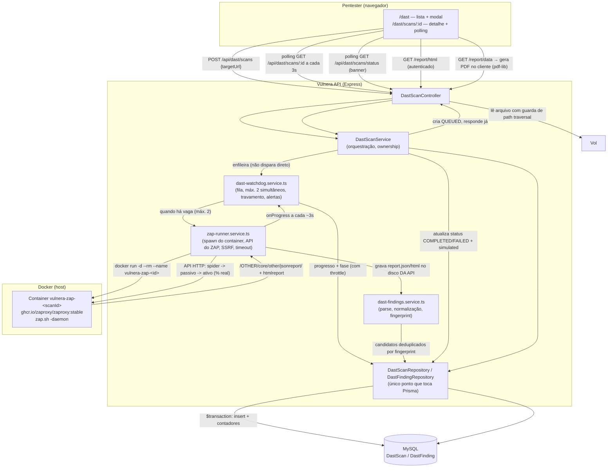

# DAST.md — Módulo de scans dinâmicos automatizados (OWASP ZAP)

> Documento vivo (CLAUDE.md §0.1). Escrito pra alguém reproduzir o módulo
> inteiro sem o autor original por perto — é entregável de TCC.

---

## 1. Visão geral

O módulo DAST dá ao **pentester** um fluxo de **um campo e um botão**: ele
informa uma URL, a plataforma sobe um container do OWASP ZAP, roda spider
(mapeamento) e active scan (ataques automatizados) contra o alvo, normaliza
e persiste os alertas encontrados, e devolve três saídas:

1. **Findings estruturados** na própria interface do Vulnera — filtráveis,
   com detalhe expandido por achado.
2. **O relatório HTML original do ZAP**, servido com sandbox de segurança.
3. **Um PDF gerado no cliente**, no mesmo estilo visual dos relatórios
   Executivo/Técnico que o produto já tem.

### O que o módulo deliberadamente NÃO faz

- **Não autentica.** Usa o JWT que o Vulnera já tem — nenhum SSO/SAML novo.
- **Não tem catálogo global de vulnerabilidades.** Cada `DastFinding` é um
  registro isolado do scan que o gerou.
- **Não suprime nem cria exceções** para findings recorrentes.
- **Não agenda scans** (sem cron, sem recorrência automática).
- **Não usa tags.**
- **Não calcula nota A-E** nem qualquer scoring agregado do estilo
  maturidade.
- **Não usa fila** (sem Redis/BullMQ) — ver [[ADR-030 - Execucao assincrona sem fila]].
- **Não resolve findings por "misses consecutivos"** entre scans.
- **Não escaneia múltiplos alvos num único scan.**
- **Não importa os achados para o cadastro `Vulnerability`** — silo próprio,
  ver [[ADR-029 - DAST como silo]].

Visível **só** para os papéis `PENTESTER` e `ADMIN`. `CLIENT` não tem item de
menu, e qualquer rota `/dast/*` ou `/api/dast/*` forçada devolve
403/redirecionamento — não existe meio-termo de visibilidade.

---

## 2. Arquitetura



Camadas do Vulnera envolvidas (CLAUDE.md §4, sem atalho):

```
Routes (dast-scan.routes.ts)
   → Factory (dast-scan.factory.ts)
     → Controller (dast-scan.controller.ts)
       → Service (dast-scan.service.ts)
         → dast-watchdog.service.ts (fila e vigia — só memória, não toca Prisma)
         → zap-runner.service.ts (execução do container — não toca Prisma)
         → dast-findings.service.ts (parsing puro — não toca Prisma)
         → Repository (dast-scan.repository.ts, dast-finding.repository.ts)
           → Prisma → MySQL
```

---

## 3. Como usar (passo a passo do pentester)

1. Logue como `PENTESTER` (ou `ADMIN`) e abra **DAST** no menu lateral.
2. Clique **Novo scan**, informe a URL do alvo (`https://exemplo.com`) e
   confirme. A tela volta pra lista com o scan em `QUEUED`.
3. Abra o scan (botão **Ver**). A tela mostra um aviso explicando que o ZAP
   está rastreando (spider) e depois testando ativamente (active scan) cada
   página encontrada — **isso leva alguns minutos**, e a tela atualiza
   sozinha a cada 5 segundos. Um cronômetro mostra o tempo decorrido.
4. Se precisar, clique **Parar** a qualquer momento — o container é
   destruído e o status vira `CANCELLED`.
5. Ao concluir (`COMPLETED`), a tela mostra 4 cartões (Alto/Médio/Baixo/Info)
   e a tabela de achados, com filtro por risco e busca por título. Clique
   **Detalhes** numa linha pra ver URL, parâmetro, CWE, evidência, descrição
   e solução completos.
6. Dois botões de saída: **Baixar PDF** (gerado no navegador, alguns
   segundos) e **Ver relatório do ZAP** (abre o HTML original numa aba nova).

**Tempo esperado:** poucos minutos contra um site pequeno/estático
(ex: `https://example.com`, ~2-3 min observados); pode passar de 10-15
minutos contra uma aplicação real com muitas páginas/formulários (ver
timeout configurável, §7).

---

## 4. Como funciona por dentro

### Comando exato do Docker

> ⚠️ **Mudou em 2026-09-09** (ver ADR-031). Até então o runner chamava
> `zap-full-scan.py` e lia o `report.json` de um volume compartilhado. Esse
> desenho não expunha progresso nenhum e quebrava com a API dentro de um
> container — ver `docs/DAST-DOCKER-GAP.md`.

```
docker run -d --rm \
  --name vulnera-zap-<scanId> \
  [--network vulnera-net | -p 127.0.0.1:<P>:<P>] \
  ghcr.io/zaproxy/zaproxy:stable \
  zap.sh -daemon -host 0.0.0.0 -port <P> \
    -config api.addrs.addr.name=.* -config api.addrs.addr.regex=true \
    -config api.key=<32 hex aleatórios> -silent
```

| Flag | Por quê |
|---|---|
| `-d` | o container fica de pé enquanto o runner conduz o scan pela API HTTP |
| `--rm` | limpa o container sozinho ao terminar — sem lixo acumulando |
| `--name vulnera-zap-<scanId>` | determinístico a partir do id do scan — é o que permite `docker rm -f` sem guardar mais nenhum estado |
| `--network vulnera-net` | quando a API roda EM container: os dois na mesma rede, endereço `http://vulnera-zap-<id>:8080`, nenhuma porta publicada |
| `-p 127.0.0.1:<P>:<P>` | quando a API roda no host: porta livre escolhida pelo runner, **a mesma dentro e fora**, presa ao loopback |
| `api.addrs.addr.name=.*` + `regex=true` | sem isso o daemon só aceitaria chamada do próprio localhost dele |
| `api.key=<aleatória>` | chave por scan; **nunca** `api.disablekey=true` |
| `-silent` | corta telemetria e checagem de add-on na subida |

Nenhum `-v`: os relatórios chegam pela API HTTP do ZAP
(`/OTHER/core/other/jsonreport/` e `htmlreport`) e quem grava em disco é o
processo Node — foi assim que o problema de tradução de caminho host↔container
deixou de existir.

**Sequência conduzida pelo runner** (é daqui que sai o percentual real):

| Fase | Endpoint | Faixa na barra |
|---|---|---|
| STARTING | `/JSON/core/view/version/` até responder | 0–8% |
| SPIDER | `/JSON/spider/action/scan/` → `/JSON/spider/view/status/` | 8–45% |
| PASSIVE | `/JSON/pscan/view/recordsToScan/` até zerar | 45–55% |
| ACTIVE | `/JSON/ascan/action/scan/` → `/JSON/ascan/view/status/` | 55–96% |
| REPORT | `/OTHER/core/other/jsonreport/` + `htmlreport` | 96–100% |

O peso de cada fase é empírico (o active scan domina o tempo num alvo real).
O percentual DENTRO de spider e active scan é o número que o próprio ZAP
reporta — não é estimativa de tempo.

### ⚠️ O ZAP é um proxy antes de ser um servidor de API

O daemon só entende a requisição como "para mim" quando o header `Host` bate
com o endereço **e a porta** em que ele mesmo escuta. Qualquer outra coisa ele
tenta encaminhar, e devolve `502 Bad Gateway`. Consequência prática: publicar
uma porta efêmera (`-p 127.0.0.1::8080`) **não funciona** — a requisição chega
com `Host: 127.0.0.1:50866` e o ZAP tenta proxiar pra si mesmo na 50866.
Por isso o runner usa a mesma porta dos dois lados no modo host, e o nome do
container na porta 8080 no modo rede.

### Critério de sucesso: o relatório, nunca o exit code

O runner considera o scan bem-sucedido quando `report.json` chega da API do
ZAP **e parseia**. Isso vale desde a primeira versão do módulo, e o motivo
histórico continua valendo pra quem for mexer aqui: `zap-full-scan.py`
retornava `2` sempre que encontrava qualquer alerta WARN/FAIL — ou seja, um
scan bem-sucedido de um alvo com header ausente saía com exit ≠ 0.
Tratar exit code como critério é o erro clássico de quem integra o ZAP pela
primeira vez.

### Normalização de URL e fingerprint

```
sha256(pluginId + "|" + normalizedUrl + "|" + (param ?? ""))
```

`normalizedUrl` é calculado ANTES do hash:

| Entrada | Normalizada |
|---|---|
| `/users/123/profile` | `/users/{id}/profile` |
| `/users/999/profile` | `/users/{id}/profile` (**mesmo** fingerprint) |
| `/orders/a1b2c3d4-e5f6-4789-a0b1-c2d3e4f5a6b7` | `/orders/{uuid}` |
| `/reset?token=eyJhbGciOiJIUzI1NiJ9&ok=1` | `/reset?ok=1` (token descartado — valor > 16 chars) |

Sem isso, o mesmo bug encontrado em URLs com ID diferente (ex: SQLi em 50
produtos diferentes) viraria 50 findings "novos" a cada scan, em vez de um
achado só reconhecido de forma estável.

### Por que a evidência fica fora do fingerprint

`evidence` (o trecho de request/response que provou a vulnerabilidade) muda
entre scans da MESMA vulnerabilidade — sessão, timestamp, nonce diferentes.
Se entrasse no hash, o mesmo achado geraria um fingerprint novo toda vez, e
a aplicação nunca reconheceria "isso já existia". A evidência é salva no
finding para auditoria, mas nunca decide sua identidade.

### Mapeamento de risco do ZAP para o enum

| `riskcode` (JSON do ZAP) | `DastRisk` |
|---|---|
| `"3"` | `HIGH` |
| `"2"` | `MEDIUM` |
| `"1"` | `LOW` |
| `"0"` | `INFO` |

Não existe `CRITICAL` na saída do ZAP — o enum não inventa esse nível.

---

## 5. Segurança

| Controle | Ataque que previne |
|---|---|
| `execFile("docker", [...args])`, nunca `exec`/template string | **Command injection.** Uma `targetUrl` com `; rm -rf /` vira só um caractere dentro de UM argumento — não há shell nenhum interpretando a string. Testado (`DAST-SEC-05`) mockando `child_process` e confirmando que o comando é sempre `"docker"` com array de argumentos, nunca `shell:true`. |
| `validateTargetUrl` — só `http:`/`https:`, e loopback/faixas privadas bloqueadas por padrão (`127.0.0.0/8`, `10.0.0.0/8`, `172.16.0.0/12`, `192.168.0.0/16`, `169.254.0.0/16`, `localhost`, `::1`) | **SSRF.** Sem essa guarda, um pentester malicioso (ou uma conta comprometida) apontaria o scanner pra `169.254.169.254` (metadata de cloud) ou varreria a rede interna do host que roda a API. `DAST_ALLOW_PRIVATE_TARGETS=true` libera só em desenvolvimento, pra escanear alvos locais como o Juice Shop. ⚠️ Limitação: a checagem é sobre o LITERAL da URL, não sobre DNS resolvido — um hostname público que só resolve pra IP privado em tempo de requisição (DNS rebinding) não é pego. |
| `resolveReportPath` — `path.basename()` + whitelist de extensão (`.json`/`.html`) + confere que o caminho final começa em `REPORTS_DIR` resolvido | **Path traversal.** `../../../etc/passwd` vira só `passwd` (rejeitado pela whitelist de extensão); mesmo um nome com diretório embutido nunca escapa de `REPORTS_DIR/<scanId>/`. Na prática, a rota HTTP nunca aceita nome de arquivo vindo de `req.params` — o caminho é sempre derivado do registro no banco (§ abaixo), a função é defesa em profundidade. |
| `Content-Security-Policy: sandbox` + `X-Content-Type-Options: nosniff` ao servir `report/html` | **XSS via relatório de terceiro.** O HTML do ZAP é conteúdo de terceiro renderizado dentro do nosso domínio — sem sandbox, um relatório malformado (ou um alvo que injetou algo capturado como evidência HTML) poderia rodar JS no contexto do Vulnera. No frontend, o HTML é buscado via axios autenticado e injetado com `<iframe sandbox="" srcDoc={html}>` — nunca `dangerouslySetInnerHTML` na página principal, nunca um `<iframe src>` apontando direto pra API (que não carregaria o Bearer token de qualquer forma). |
| `requireRole("PENTESTER", "ADMIN")` em todas as 7 rotas + ownership fina no service (`getOwnedScan`) | **Acesso indevido.** `CLIENT` nunca alcança o service. Entre `PENTESTER`s, cada um só vê os próprios scans (`requestedById`); `ADMIN` vê todos. Testado nas 7 rotas (`DAST-RBAC-01..07`) e no isolamento entre dois pentesters (`DAST-RBAC-08`). |
| `docker rm -f` sempre explícito no timeout/cancelamento, nunca dependência de sinal de processo | **Container órfão.** `execFile`'s `timeout` mata o PROCESSO CLIENTE `docker run`, mas isso não garante que o CONTAINER pare — Docker é cliente/servidor, o container não é filho do processo local. Confirmado manualmente: matar só o processo cliente deixaria o container rodando; `docker rm -f` é a única garantia real. |
| Acesso ao socket Docker pela própria API | Risco ACEITO e documentado, não mitigado por completo — ver [[ADR-028 - Execucao do ZAP via Docker spawn]]. |

---

## 6. Modelo de dados

### `DastScan` — uma execução

| Campo | Tipo | Motivo |
|---|---|---|
| `id` | `String @id @default(cuid())` | padrão do projeto |
| `targetUrl` | `String @db.VarChar(2048)` | URL cabe em 2048; **não indexado sozinho** (índice completo estouraria o teto de bytes por índice do MySQL) |
| `status` | `DastScanStatus` (enum nativo) | ver §0.1 sobre a exceção à filosofia "sem enums" |
| `requestedById` | `String` → `User` | dono, usado no ownership |
| `containerName` | `String?` | `vulnera-zap-<id>`, guardado pra cancelar sem recalcular |
| `startedAt` / `finishedAt` / `durationMs` | | telemetria da execução |
| `errorMessage` | `String? @db.Text` | populado em `FAILED`/`CANCELLED` |
| `htmlReportPath` / `jsonReportPath` | `String?` | caminho absoluto no disco — NUNCA exposto em DTO de resposta |
| `progress` | `Int @default(0)` | 0..100 consolidado das fases; escrito pelo runner com throttle (só quando a fase muda ou o percentual anda 1 ponto, no máx. 1x/s) |
| `phase` | `String?` | rótulo curto da fase corrente (`QUEUED`, `STARTING`, `SPIDER`, `PASSIVE`, `ACTIVE`, `REPORT`, `DONE`, `SIMULATED`, `FAILED`, `CANCELLED`) — String e não enum: é rótulo de UI, `status` é a máquina de estados |
| `simulated` | `Boolean @default(false)` | `true` = achados vieram do gerador de demonstração, não do ZAP |
| `warningMessage` | `String? @db.Text` | aviso amigável de um scan que CONCLUIU com ressalva; distinto de `errorMessage`, que só existe em `FAILED` |
| `alertsHigh/Medium/Low/Info` | `Int @default(0)` | contadores, sempre recalculados dos findings persistidos |

Índices: `@@index([requestedById])`, `@@index([status])`,
`@@index([status, targetUrl(length: 191)])` — sustenta a checagem "1 scan por
alvo de cada vez" sem estourar o teto de bytes de índice (prefixo de 191
chars, mesmo problema já documentado no CLAUDE.md §2).

### `DastFinding` — um alerta normalizado (1 instance do JSON = 1 registro)

| Campo | Tipo | Motivo |
|---|---|---|
| `fingerprint` | `String` (sha256 hex, 64 chars) | identidade estável — seguro pro índice único |
| `pluginId`, `title`, `risk`, `confidence`, `cweId`, `wascId` | | direto do alerta do ZAP |
| `url` | `String @db.Text` | não indexado — URL pode passar de 191 chars |
| `normalizedUrl` | `String @db.Text` | idem |
| `param`, `evidence`, `description`, `solution`, `reference` | `String?` (últimos 4 `@db.Text`) | `description`/`solution`/`reference` chegam do ZAP em HTML e são limpos (tags removidas) antes de persistir |

Índices: `@@index([scanId])`, `@@index([risk])`,
`@@unique([scanId, fingerprint])` — a unicidade é o que garante "reprocessar
o mesmo scan não duplica" (`DAST-PIPE-03`).

**⚠️ Enum nativo:** `DastScanStatus`/`DastRisk` usam `enum` nativo do Prisma,
divergindo da filosofia documentada no cabeçalho do `schema.prisma`
("sem enums nativos"). Decisão explícita, confirmada com o Rafael durante a
Fase 1 — os dois conjuntos de valores são fechados por contrato externo
(taxonomia fixa do ZAP; máquina de 5 estados interna) e não se espera
precisar adicionar valor sem mexer em código de qualquer forma.

---

## 7. Configuração

| Variável | Default | Efeito |
|---|---|---|
| `DAST_REPORTS_DIR` | `dast-reports` | Diretório (relativo ao cwd do processo) onde cada scan grava `report.json`/`report.html`, um subdiretório por `scanId`. |
| `DAST_ZAP_IMAGE` | `ghcr.io/zaproxy/zaproxy:stable` | Imagem Docker usada no `docker run`. |
| `DAST_SCAN_TIMEOUT_MS` | `1800000` (30min) | Tempo máximo de um scan antes do runner matar o container e marcar `FAILED`/`SCAN_TIMEOUT`. |
| `DAST_ALLOW_PRIVATE_TARGETS` | `false` | `true` libera loopback/faixas privadas como alvo — **só em desenvolvimento**, necessário pra escanear alvos locais (Juice Shop). |
| `DAST_FORCE_SIMULATE` | `false` | `true` força o fallback simulado mesmo com Docker disponível — usado em `.env.test` pra a suíte nunca depender de Docker/rede real. |
| `DAST_ZAP_NETWORK` | *(vazio)* | Rede Docker onde criar o container do ZAP. **Vazio** = API no host (o runner publica uma porta livre em 127.0.0.1). **`vulnera-net`** = API em container (alcança o ZAP pelo nome, sem publicar porta). Preenchida pelo `docker-compose.yml`. |
| `DAST_MAX_CONCURRENT_SCANS` | `2` | Teto de scans simultâneos; o watchdog enfileira o excedente. Cada scan é uma JVM de ~1GB. |
| `DAST_ZAP_STARTUP_TIMEOUT_MS` | `180000` (3min) | Espera máxima pelo daemon do ZAP responder depois do `docker run`. |
| `DAST_ZAP_SPIDER_MAX_DURATION_MIN` | `5` | Teto de minutos do spider (`0` desliga). Sem ele, um alvo grande rastreia até o timeout global. |
| `DAST_HEARTBEAT_TIMEOUT_MS` | `120000` (2min) | Silêncio máximo tolerado num scan em execução antes de o watchdog abortar e avisar. |
| `DAST_ZAP_MEMORY` | `2g` | Teto de RAM de **cada** container do ZAP (`--memory` + `--memory-swap`). Deriva também o `-Xmx` da JVM (~65% do teto) — ver o aviso abaixo. |
| `DAST_ZAP_CPUS` | `4` | Teto de CPUs de cada container (`--cpus`, aceita fração). |

⚠️ **`DAST_MAX_CONCURRENT_SCANS` e `DAST_ZAP_MEMORY`/`DAST_ZAP_CPUS` são
limites de eixos diferentes, e um não cobre o outro.** O primeiro limita
QUANTOS scans rodam; os outros dois, QUANTO cada um consome. Medição de
2026-09-09 com dois scans reais e **sem** os dois últimos:

```
vulnera-zap-...ib0007 | 936.8MiB / 7.7GiB | CPU 398%
vulnera-zap-...g30003 |  1.39GiB / 7.7GiB | CPU 564%
```

"7.7GiB" ali é a RAM inteira da VM do Docker — teto nenhum — e os dois juntos
ocupavam ~960% de 1200% de CPU. Ao ajustar, mantenha
`DAST_MAX_CONCURRENT_SCANS × DAST_ZAP_MEMORY` abaixo da RAM disponível ao
Docker, com folga pro MySQL e pela API.

⚠️ **Nunca defina `DAST_ZAP_MEMORY` sem que o `-Xmx` acompanhe.** O `zap.sh`
calcula o heap como 1/4 da memória que lê em `/proc/meminfo`, e isso é a RAM
do **host**, não o limite do cgroup: com `--memory 2g` e sem `-Xmx`, a JVM
acha que tem 7.7GB, pede ~1.9GB de heap e é morta por OOM no meio do active
scan. O runner faz isso sozinho (`heapArgForMemoryLimit()`), então a única
forma de errar é passar `-Xmx` à mão em outro lugar.

---

## 8. Alvos de laboratório

```bash
# OWASP Juice Shop — cobre bem o Top 10, flagship da própria OWASP
docker run -d --rm -p 3500:3000 --name juice-shop bkimminich/juice-shop
# alvo do scan: http://host.docker.internal:3500 (se a API rodar em container)
# ou http://localhost:3500 (API rodando local, fora de container)
```

Alternativas equivalentes: DVWA, Mutillidae II, bWAPP — mesmo princípio,
imagem Docker + `-p <porta>:<porta interna>`.

⚠️ Escanear qualquer um desses exige `DAST_ALLOW_PRIVATE_TARGETS=true` no
`.env` da API (são alvos em loopback/rede local).

---

## 9. Solução de problemas

Erros REAIS encontrados construindo o módulo (Fases 0-8 e a sessão de
2026-09-09), não hipotéticos:

**0. Todo scan sai marcado "simulado" mesmo com o Docker rodando.**
Abra `GET /api/dast/scans/status` (ou o banner no topo de `/dast`): ele diz se
o Docker está acessível **pra API**. Se `dockerAvailable: false` com a stack em
container, a causa quase certa é permissão no socket — `docker compose exec api
docker info` reproduz o erro na hora. Ver ADR-031 §2 (o usuário `vulnera`
precisa do GID dono do socket; em Docker Desktop é o 0, em host Linux costuma
ser o grupo `docker`).

**0b. O scan real falha e a tela mostra achados mesmo assim.**
É o comportamento pretendido desde 2026-09-09: falha do scan real cai no
resultado simulado, com selo "simulado" e a explicação em PT-BR no campo
`warningMessage`. O motivo técnico completo fica no log do servidor
(`[DAST] Scan real <id> falhou (...) — caindo pro resultado simulado`).

**1. Imagem do ZAP não baixada — primeiro scan trava minutos "silenciosamente".**
`docker pull ghcr.io/zaproxy/zaproxy:stable` sozinho, ANTES do primeiro scan
de verdade — a imagem tem centenas de MB e um `docker run` que precisa
baixar a imagem primeiro parece travado sem nenhum log visível na API.

**2. Caminho de volume no Windows quebra quando invocado via Git Bash/MSYS.**
Rodar `docker run -v /caminho/...` manualmente a partir do Git Bash mangla o
path (`/tmp/foo` vira algo como `C:\Program Files\Git\tmp\foo` misturado com
o próprio `:` do drive, quebrando a sintaxe do `-v`). **Isso NÃO afeta o
runner de produção** — Node's `execFile` chama `docker.exe` diretamente, sem
passar por nenhum shell MSYS, então o path nativo do Windows
(`C:\Users\...`) funciona sem nenhuma conversão. Confirmado testando os dois
caminhos lado a lado na Fase 2: `docker run` direto do Git Bash falha
(`mkdir C:\Program Files\Git\tmp\...: Access is denied`); o mesmo comando
via PowerShell (ou via `execFile` do Node) funciona sem alteração nenhuma.
**Se for depurar manualmente no Windows, use PowerShell/CMD, não Git Bash.**

**3. `isDockerAvailable()` cai no fallback simulado com Docker rodando.**
O primeiro `docker info` depois de o Docker Desktop acabar de iniciar (ou em
ambientes WSL2 "frios") levou ~6s pra responder nesta máquina — um timeout
de 5s classificava Docker como indisponível e o scan ia pro fallback
simulado por engano, mesmo com um `docker run` manual funcionando
perfeitamente ao lado. Corrigido subindo o timeout do healthcheck pra 10s.

**4. Timeout em alvo grande.** Contra uma aplicação real com muitas páginas
e formulários, o active scan pode passar longe dos 30 minutos default. Não é
bug — é o próprio ZAP demorando de verdade. Ajuste `DAST_SCAN_TIMEOUT_MS`
pro alvo, ciente de que o scan será `FAILED`/`SCAN_TIMEOUT` (e o container
morto) se o alvo simplesmente precisar de mais tempo que o configurado.

**5. Prisma Client desatualizado / dependência ausente (achado na Fase 0, não específico do DAST).**
Antes de tocar em qualquer código do módulo, `npm run check` já estava
quebrado no branch por dois motivos de ambiente: Prisma Client sem
`expoPushToken` (resolvido com `npx prisma generate`) e `expo-server-sdk`
ausente do `node_modules` apesar de estar no `package.json` (resolvido com
`npm install` na raiz). Não é causado pelo módulo DAST, mas bloqueava
qualquer verificação — registrado aqui porque é exatamente o tipo de coisa
que trava quem tenta reproduzir o projeto do zero.

---

## 10. Limitações conhecidas

Documentadas de propósito — limitação escondida é falha, limitação
declarada é maturidade (CLAUDE.md R5):

- **Sem fila (Redis/BullMQ).** Execução é fire-and-forget dentro do próprio
  processo Node; reiniciar a API durante um scan real perde o progresso
  daquele scan (watchdog evita que fique "fantasma" pra sempre, não o
  recupera). Ver [[ADR-030 - Execucao assincrona sem fila]].
- **Sem agendamento/recorrência.** Todo scan é disparado manualmente.
- **Sem deduplicação entre scans na interface.** O fingerprint é estável
  entre execuções (mesma vulnerabilidade normalizada = mesmo hash), mas a
  aplicação não compara automaticamente "isso já apareceu num scan
  anterior" — cada scan é uma lista independente na tela.
- **Sem importação para `Vulnerability`.** Achados do DAST vivem só dentro
  do módulo. Ver [[ADR-029 - DAST como silo]] para o caminho de integração
  futura.
- **Sem antivírus/varredura de conteúdo malicioso** nos relatórios gerados
  pelo ZAP — a mitigação de XSS é o sandbox do iframe (§5), não uma
  varredura de conteúdo.
- **SSRF: checagem sobre o literal da URL, não sobre DNS resolvido** — um
  hostname público que resolve pra IP privado só em tempo de requisição
  (DNS rebinding) não é bloqueado.
- **Versão do ZAP não persistida por scan** — quem precisar da versão exata
  usada numa execução consulta o cabeçalho do relatório HTML original
  (`report/html`), que sempre traz essa informação.
- **Um alvo por scan.** Não há varredura de múltiplos hosts numa única
  execução.
- **Acesso ao socket Docker pela API** — risco assumido e documentado em
  [[ADR-028 - Execucao do ZAP via Docker spawn]], não eliminado.

---

## 11. O que fazer com o resultado — triagem, promoção e comparação

> Adicionado em 2026-09-09. Decisão completa em
> [[ADR-032 - Triagem, promocao para Vulnerability e comparacao de scans DAST]].

Até esta data o módulo terminava num beco: o scan rodava, mostrava as dezenas
de alertas e a única saída era um PDF. Três coisas passam a ser possíveis.

### 11.1 Triar

Cada finding tem um estado de triagem: **Por triar** (`NEW`, o padrão),
**Confirmado**, **Falso-positivo** ou **Risco aceito**, com nota opcional,
autor e data. Na tela de detalhe do scan, a coluna "Triagem" mostra o estado e
o botão `N por triar` filtra direto o que ainda não foi olhado.

O status salva **no clique**, sem botão "salvar" — é a tarefa mais repetitiva
da tela e exigir dois cliques por achado é o tipo de atrito que faz a
funcionalidade não ser usada. A nota é a exceção (texto livre precisa de um
commit explícito).

```
PATCH /api/dast/scans/findings/:findingId/triage
{ "triageStatus": "FALSE_POSITIVE", "note": "Header ausente por design." }
```

### 11.2 Promover para `Vulnerability`

Leva o achado para um `Project` real, entrando no fluxo normal de triagem e
remediação do produto (evidências, comentários, relatório, dashboards).

**O vetor CVSS é sugerido, nunca inventado — e esta é a parte que importa.**
O [[ADR-029 - DAST como silo]] tinha recusado a importação automática por uma
razão correta: o ZAP **não fornece vetor CVSS**, só `riskcode` de 0 a 3.
Derivar um vetor completo disso seria inventar, e um score inventado
convincente é pior que score nenhum — o resto do produto trata `cvssScore`
como calculado com confiança (RN10).

O que existe hoje é a saída que o próprio ADR-029 apontava: o formulário abre
pré-preenchido (título, descrição já com a proveniência do scan, categoria
OWASP deduzida do CWE, vetor CVSS sugerido pela faixa de risco), **marca o
vetor como sugestão num alerta visível**, e o pentester confirma antes de
salvar. Só então `calculateCvss` roda — sobre o vetor revisado.

Consequência que vale saber ao defender o trabalho: **o produto continua sem
uma única `Vulnerability` com CVSS estimado.**

Duas assimetrias deliberadas no que é pré-preenchido:

- **CWE → categoria OWASP é factual** (o OWASP publica quais CWEs compõem cada
  categoria do Top 10 2021), então é aplicado direto.
- **risco → vetor CVSS é suposição**, então vem com aviso explícito na tela.

Outras garantias: um finding vira **no máximo uma** `Vulnerability` (índice
`@unique` no banco, não checagem de aplicação); só dá pra promover pra um
projeto em que o ator seja **membro** (promover não é porta lateral pra
escrever em projeto alheio); e apagar o scan de origem **não apaga** a
vulnerability promovida (`onDelete: SetNull` — perde-se o ponteiro pra origem,
nunca o achado).

```
GET  /api/dast/scans/findings/:findingId/promotion-draft
POST /api/dast/scans/findings/:findingId/promote
```

### 11.3 Comparar duas execuções

Responde a pergunta que fecha um pentest: *a correção funcionou?* Na aba
"Comparar com execução anterior", escolha uma execução mais antiga **do mesmo
alvo** e o resultado sai em três grupos: **Resolvidos**, **Novos** e
**Continuam abertos**.

O diff é por `fingerprint` — `sha256(pluginId | normalizedUrl | param)` — que
**não inclui a evidência**, justamente porque ela muda entre execuções da
mesma vulnerabilidade. É isso que faz um problema não corrigido aparecer como
"continua aberto" em vez de virar um par falso de "sumiu um / surgiu outro".

Comparar scans de **alvos diferentes** devolve `422 SCANS_TARGET_MISMATCH` em
vez de um diff: seria 100% "sumiu" + 100% "apareceu", correto e inútil.

```
GET /api/dast/scans/:id/comparable          # execuções comparáveis
GET /api/dast/scans/:id/compare?base=<id>   # :id é o mais NOVO, base o mais antigo
```

### 11.4 Testes de ponta a ponta (Playwright)

`app/web/e2e/` dirige um Chrome real contra a stack real:

```bash
docker compose up -d                              # na raiz
docker compose exec api npm run db:seed           # se o banco estiver vazio
npm run test:e2e --workspace=app/web
npm run test:e2e:ui --workspace=app/web           # modo interativo
```

Não há `webServer` na config **de propósito**: o alvo é a stack de verdade
(mesmo banco, mesmo Docker que a demonstração usa). Por isso **não** entra no
`npm run check`, que precisa continuar rodando sem Docker.

⚠️ **Rode a suíte sozinha.** Cada caso dispara scans reais, e cada scan é uma
JVM de até 2GB somada à VM do Docker, ao Chrome do Playwright e ao Node.
Rodando junto com `npm test` do backend numa máquina de 16GB, o SO matou o
worker com `worker process exited unexpectedly (code=3221225794)` — que
**parece** falha de teste e não é. Ao ver essa mensagem, feche o que estiver
aberto e rode de novo antes de suspeitar do produto.

O caso `E2E-01` é o que prova que a barra de progresso mostra medição e não
animação: ele exige que o percentual **suba** e que as fases nomeadas do ZAP
apareçam na tela. Uma barra estimada por tempo passaria na primeira asserção e
falharia na segunda.

---

## Docs relacionados

- [[ADR-028 - Execucao do ZAP via Docker spawn]]
- [[ADR-029 - DAST como silo]]
- [[ADR-030 - Execucao assincrona sem fila]]
- [[ADR-032 - Triagem, promocao para Vulnerability e comparacao de scans DAST]]
- `PRD_VIVO.md`, `docs/BACKLOG.md`, `docs/ROADMAP_PROMPTS.md`, `docs/DECISIONS.md`
- `docs/evidencias/dast/README.md` — os dois relatórios reais da validação
  end-to-end (`example.com` como controle negativo, OWASP Juice Shop como
  controle positivo — achou Backup File Disclosure com 31 instâncias)
