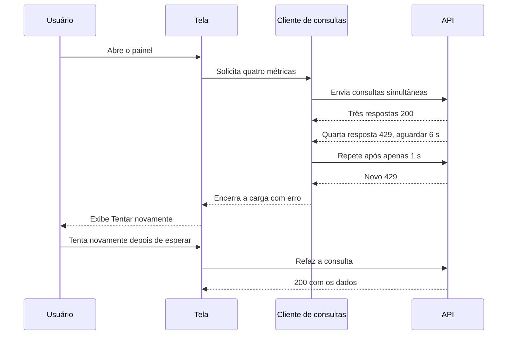
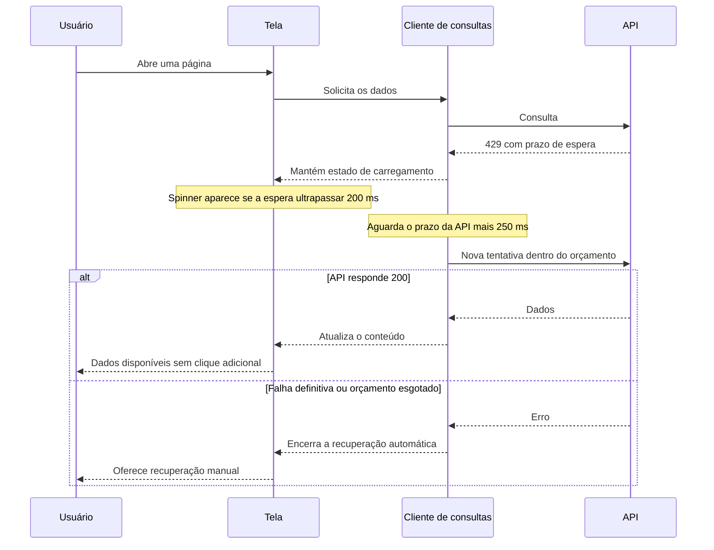
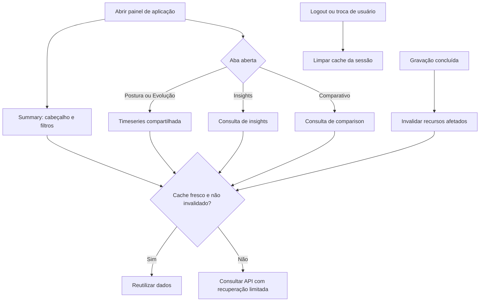

<!--
  O que faz: fornece título e descrição para abertura manual da PR.
  Por que existe: explica a correção e seus fluxos com evidências revisáveis.
  Quem consome: Rafael e revisores da PR no GitHub.
-->

# Título sugerido

fix(web): corrigir erros de carregamento ao navegar entre telas

**Base:** `dev`  
**Compare:** `fix/fix-page-loading`  
**Commit de implementação:** `92f00b5`

---

## Descrição da PR

Ao abrir ou trocar de tela, consultas podiam exibir erro e só carregar depois
de clicar em **Tentar novamente**. Esta PR recupera falhas temporárias
automaticamente, respeita o prazo informado pela API e mantém feedback de
carregamento durante a espera.

### Problema identificado

As APIs do frontend já retornavam Promises corretamente. O dashboard de
aplicação disparava quatro consultas caras simultâneas contra um bucket com
burst de três. A quarta recebia `429 RATE_LIMITED`, pedindo seis segundos de
espera, mas o frontend fazia sua única retentativa após apenas um segundo.
Navegação frequente também podia esgotar os limites de usuário/global.

### Recuperação e feedback

- Leituras fazem até **duas retentativas** em erros de rede Axios,
  HTTP `500/502/503/504` e `429` recuperável.
- Em `429`, a espera usa `retryAfterSeconds` do JSON, com fallback para
  `Retry-After`, mais **250 ms**. Prazos acima de 30 s encerram o retry automático.
- Cancelamentos, falhas definitivas como `401/403/404` e gravações não são
  repetidos automaticamente.
- Spinner no cabeçalho aparece após **200 ms**, preserva espaço e acompanha
  skeletons existentes. Possui anúncio acessível e respeita movimento reduzido.
- `networkMode: always` permite que consultas informem falha e ofereçam
  recuperação mesmo quando o navegador informa estar offline.
- No detalhe de finding, **Tentar novamente** refaz o GET e mantém a tela aberta.

### Menos consultas e consistência dos dados

Leituras permanecem frescas por **30 segundos** para reduzir requisições ao
voltar a uma tela. Gravações invalidam os caches dos recursos afetados;
logout ou troca de usuário limpa o cache, enquanto a rotação de tokens da
mesma sessão o preserva.

O painel busca somente as métricas necessárias à aba aberta. Trocar apenas
a aba preserva a janela do período e a chave das consultas compartilhadas.
`useOutlet` também preserva o contexto da página em saída na transição animada.

### Validação

| Verificação | Resultado |
| --- | --- |
| Web: `npm run check -- -- --maxWorkers=1 --silent` no contêiner | **286/286 testes**, 27 suítes |
| Testes novos | **29**, cobrindo recuperação, cache, sessão, abas e feedback |
| Lint web | **0 erros**, 9 avisos preexistentes |
| Contraste | **66/66** pares aprovados |
| Build web: `tsc --noEmit && vite build` no contêiner | Aprovado |
| Chrome, web em modo dev/StrictMode, API e banco reais | **17/17** verificações |
| 429 controlado em Projetos | Espera de 2 s e recuperação sem clique |
| 429 real de timeseries | Resposta 200 após **6,276 s** |
| Mobile | 375 px, movimento reduzido e sem overflow horizontal |

O smoke cobriu ADMIN em Dashboard, Aplicações, Projetos, Findings, Remediação,
Playbooks, DAST, SLA, Aprovações e painel de aplicação. Permissões de CLIENT e
PENTESTER continuam cobertas pela suíte existente. Nenhum scan DAST ou escrita
de domínio foi executado nessa validação.

### Escopo e ressalvas

Os limites de segurança da API foram mantidos. Não há alteração de schema,
migration, dependências ou lockfiles. Falhas persistentes continuam exibindo
recuperação manual; alterações de outros usuários podem aguardar a próxima
revalidação após os 30 s de cache.

O host tinha `@playwright/test`, `dompurify` e `marked` ausentes; checks e build
foram executados com as dependências completas da imagem web existente.
Permanece o aviso anterior de bundle maior que 500 kB. O comportamento de logout
por falha de rede no refresh continua registrado separadamente como L-17.

### Documentação e evidências

PRD, BACKLOG, ROADMAP, Changelog e FRONTEND_WEB atualizados; L-16 concluída.

- Decisão: `docs/Vulnera/07-Decisoes/ADR-044 - Recuperacao de leituras e cache na navegacao.md`.
- Relatório: `output/page-loading-validation.md`.
- Smoke reproduzível e resultados: `output/page-loading-smoke.cjs` e `output/page-loading-smoke-result.json`.
- Capturas: `output/page-loading-spinner.png` e `output/page-loading-mobile.png`.
